```r
knitr::opts_chunk$set(fig.align = "center")
ggplot2::theme_set(ggplot2::theme_minimal())
```


# Welcome!

Hello, and welcome to my very first Markdown publication. 
The vast majority of my time spent with R has been for university courses, so
I thought it would be a good change of pace to apply the skills I've learned
to a personal project. I have learned a great deal from books like 
Hadley Wickham's [R for Data Science](https://r4ds.had.co.nz/), as well as 
tutorials, articles, and markdown pages from sites such as 
[RPubs](https://rpubs.com/), [R-bloggers](https://www.r-bloggers.com/), 
and [Towards Data Science](https://towardsdatascience.com/). 
My hope is that this project can in turn be used to help someone else down 
the road, as others have helped me.

In this project, we will be exploring how to use Spotify's API and 
the **spotifyr** package to access data about a particular artists discography. 
We'll also be utilizing the **geniusr** package to retrieve lyrics for 
songs, allowing for sentiment to be explored and visualized, and doing our best
to apply a clustering algorithm to the discography.

# Spotify API Credentials

To begin, we will first need to head over to the 
[Spotify for Developers](https://developer.spotify.com/dashboard/) page, 
where we will be registering an application to obtain an API key. Once you've 
logged in, select "Create an App" and fill out the required fields. Completing 
this will give you access to two important fields: your **client id** and 
your **client secret** (or API key). These fields will be used to let the
API know who is accessing it and that you have proper authentication. 
To get started, first install the **spotifyr** package if you don't already
have it.


```r
install.packages("spotifyr")
```

Next, we can use the following code to pass out authentication credentials
to the API, giving us access.


```r
Sys.setenv(SPOTIFY_CLIENT_ID = 'your client id')
Sys.setenv(SPOTIFY_CLIENT_SECRET = 'your client secret')
access_token <- get_spotify_access_token()
```


# Gathering the Data

Now that you are authenticated with the API, we can begin using the 
**spotifyr** package's functions to retrieve information.
In this project, we will be analyzing Mac Miller's discography and exploring 
how his sound changed throughout his career. To get information regarding 
a single artist's discography, we can use the `get_artist_audio_features()` 
function. The function will return a dataframe containing information about all 
of the artists' music that is hosted on Spotify. The function takes many 
possible arguments, but for the sake of this project, we only need to pass in 
one: the name of the artist for which we wish to get information.


```r
library(spotifyr)
mm_data <- get_artist_audio_features(artist = "Mac Miller")
```

To check that this function performed as expected, let's take a very quick
glance at the returned dataframe.


```r
colnames(mm_data)
```

```
##  [1] "artist_name"                  "artist_id"                   
##  [3] "album_id"                     "album_type"                  
##  [5] "album_images"                 "album_release_date"          
##  [7] "album_release_year"           "album_release_date_precision"
##  [9] "danceability"                 "energy"                      
## [11] "key"                          "loudness"                    
## [13] "mode"                         "speechiness"                 
## [15] "acousticness"                 "instrumentalness"            
## [17] "liveness"                     "valence"                     
## [19] "tempo"                        "track_id"                    
## [21] "analysis_url"                 "time_signature"              
## [23] "artists"                      "available_markets"           
## [25] "disc_number"                  "duration_ms"                 
## [27] "explicit"                     "track_href"                  
## [29] "is_local"                     "track_name"                  
## [31] "track_preview_url"            "track_number"                
## [33] "type"                         "track_uri"                   
## [35] "external_urls.spotify"        "album_name"                  
## [37] "key_name"                     "mode_name"                   
## [39] "key_mode"
```

```r
unique(mm_data$album_name)
```

```
##  [1] "Faces"                                              
##  [2] "Circles (Deluxe)"                                   
##  [3] "Circles"                                            
##  [4] "Swimming"                                           
##  [5] "The Divine Feminine"                                
##  [6] "Best Day Ever (5th Anniversary Remastered Edition)" 
##  [7] "GO:OD AM"                                           
##  [8] "Live From Space"                                    
##  [9] "Watching Movies with the Sound Off (Deluxe Edition)"
## [10] "Watching Movies with the Sound Off"                 
## [11] "Mac Miller : Live From London (With The Internet)"  
## [12] "Macadelic (Remastered Edition)"                     
## [13] "Blue Slide Park (Commentary Version)"               
## [14] "Blue Slide Park (Edited Version)"                   
## [15] "Blue Slide Park"                                    
## [16] "K.I.D.S. (Deluxe)"                                  
## [17] "K.I.D.S."
```

```r
head(mm_data$track_name, 15)
```

```
##  [1] "Inside Outside"                          
##  [2] "Here We Go"                              
##  [3] "Friends (feat. ScHoolboy Q)"             
##  [4] "Angel Dust"                              
##  [5] "Malibu"                                  
##  [6] "What Do You Do (feat. Sir Michael Rocks)"
##  [7] "It Just Doesn’t Matter"                  
##  [8] "Therapy"                                 
##  [9] "Polo Jeans (feat. Earl Sweatshirt)"      
## [10] "Happy Birthday"                          
## [11] "Wedding"                                 
## [12] "Funeral"                                 
## [13] "Diablo"                                  
## [14] "Ave Maria"                               
## [15] "55"
```

```r
dim(mm_data)
```

```
## [1] 305  39
```

Excellent! The returned dataframe contains `305` observations,
or in this case songs, and each observation has `39` variables.

# Checking the Data

We can see from the `unique(mm_data$album_name)` function that the albums are
listed in order of upload date, with Faces being the most recent album added
to Mac's Spotify page. While this may seem handy, it is important to note that
the order in which albums are uploaded to Spotify is not always the same order
that the albums were released. We can observe this by taking a look at the
`album_release_date` variable.


```r
library(tidyverse)
library(plotly)
```


```r
mm_data %>% 
  select(album_name, album_release_date) %>%
  distinct()
```

```
## # A tibble: 17 x 2
##    album_name                                          album_release_date
##    <chr>                                               <chr>             
##  1 Faces                                               2021-10-15        
##  2 Circles (Deluxe)                                    2020-03-19        
##  3 Circles                                             2020-01-17        
##  4 Swimming                                            2018-08-03        
##  5 The Divine Feminine                                 2016-09-16        
##  6 Best Day Ever (5th Anniversary Remastered Edition)  2016-06-03        
##  7 GO:OD AM                                            2015-09-18        
##  8 Live From Space                                     2013-12-17        
##  9 Watching Movies with the Sound Off (Deluxe Edition) 2013-06-18        
## 10 Watching Movies with the Sound Off                  2013-06-18        
## 11 Mac Miller : Live From London (With The Internet)   2013-01-01        
## 12 Macadelic (Remastered Edition)                      2012-03-23        
## 13 Blue Slide Park (Commentary Version)                2011-11-15        
## 14 Blue Slide Park (Edited Version)                    2011-11-15        
## 15 Blue Slide Park                                     2011-11-08        
## 16 K.I.D.S. (Deluxe)                                   2010-08-13        
## 17 K.I.D.S.                                            2010-08-13
```

This readout implies that Faces is the most recent album to release. However,
by checking Mac's 
[discography](https://en.wikipedia.org/wiki/Mac_Miller_discography), we can see
that Faces was actually released as a mixtape back in 2014, much earlier than
the variable from Spotify's data would suggest. Since this project involves 
analyzing how Mac's music changed throughout the duration of his career, it is
important to have accurate ordering of dates associated with the albums.

## Webscraping

To remedy this, we can use some quick web scraping to pull the release dates 
from the wiki page and amend the data.


```r
# run install.packages('rvest') if you don't have this package already
library(rvest)
url <- "https://en.wikipedia.org/wiki/Mac_Miller_discography"
wp <- read_html(url)
rel_dates <- html_nodes(
  wp, "th i , .plainrowheaders th+ td li:nth-child(1) , th i a") %>%
  html_text()
```

Now, the above code may look a little intimidating if you are new to
webscraping. That's okay, it looks much scarier than it really is. The
`read_html()` function simply reads the page's html code and stores it as a 
list in your R environment. Then, we need to tell R what parts of the webpage
we want extracted. To do this, I used the 
[SelectorGadget](https://chrome.google.com/webstore/detail/selectorgadget/mhjhnkcfbdhnjickkkdbjoemdmbfginb?hl=en) extension for Chrome. Using the tool makes webscraping
very simple, you just highlight the elements you wish to capture and the tool
will give you the CSS selector for it. That is how the arguments you see in the
`html_nodes()` function were found. Once you've identified the nodes, pass the
results to the `html_text()` function and voila! You know have text from a
website stored right in your R environment.

Let's check out what our scraping resulted in:


```r
head(rel_dates, 20)
```

```
##  [1] "Blue Slide Park"                    "Blue Slide Park"                   
##  [3] "Released: November 8, 2011[16]"     "Watching Movies with the Sound Off"
##  [5] "Watching Movies with the Sound Off" "Released: June 18, 2013[20]"       
##  [7] "GO:OD AM"                           "GO:OD AM"                          
##  [9] "Released: September 18, 2015[22]"   "The Divine Feminine"               
## [11] "The Divine Feminine"                "Released: September 16, 2016[24]"  
## [13] "Swimming"                           "Swimming"                          
## [15] "Released: August 3, 2018[26]"       "Circles"                           
## [17] "Circles"                            "Released: January 17, 2020[31]"    
## [19] "Live from Space"                    "Live from Space"
```

### Cleaning the scraped data

While that looks pretty good, you can see that the album titles are listed
twice, and the release dates could be formatted a little nicer. Let's fix that
up to a nicer format.


```r
# Remove duplicates and format into dataframe for manipulation
rel_dates <- matrix(
  unique(rel_dates), ncol = 2, byrow = T) %>%
  as.data.frame()

# Filter out any works that aren't hosted on Spotify
rel_dates <- rel_dates %>% filter(
  V1 %>% tolower() %in% (unique(mm_data$album_name) %>% 
                    gsub("( \\().*", "", .) %>%
                    tolower()))

# Cleaning date text
rel_dates$V2 <- gsub("(?:Released: )", "", rel_dates$V2)
rel_dates$V2 <- gsub(".{4}$", "", rel_dates$V2)

# Converts textual dates to date type object
rel_dates$V2 <- lubridate::parse_date_time(
  rel_dates$V2, orders = "mdy") %>%
  lubridate::as_date()

# Check results to ensure they look as expected
rel_dates
```

```
## # A tibble: 11 x 2
##    V1                                 V2        
##    <chr>                              <date>    
##  1 Blue Slide Park                    2011-11-08
##  2 Watching Movies with the Sound Off 2013-06-18
##  3 GO:OD AM                           2015-09-18
##  4 The Divine Feminine                2016-09-16
##  5 Swimming                           2018-08-03
##  6 Circles                            2020-01-17
##  7 Live from Space                    2013-12-17
##  8 K.I.D.S.                           2010-08-13
##  9 Best Day Ever                      2011-03-11
## 10 Macadelic                          2012-03-23
## 11 Faces                              2014-05-11
```

## Prepping for Merge

Now our release dates are in a more workable format. However, before we merge
the two datasets, let's first take one more look at the album names in our 
main dataframe, `mm_data`. 


```r
unique(mm_data$album_name)
```

```
##  [1] "Faces"                                              
##  [2] "Circles (Deluxe)"                                   
##  [3] "Circles"                                            
##  [4] "Swimming"                                           
##  [5] "The Divine Feminine"                                
##  [6] "Best Day Ever (5th Anniversary Remastered Edition)" 
##  [7] "GO:OD AM"                                           
##  [8] "Live From Space"                                    
##  [9] "Watching Movies with the Sound Off (Deluxe Edition)"
## [10] "Watching Movies with the Sound Off"                 
## [11] "Mac Miller : Live From London (With The Internet)"  
## [12] "Macadelic (Remastered Edition)"                     
## [13] "Blue Slide Park (Commentary Version)"               
## [14] "Blue Slide Park (Edited Version)"                   
## [15] "Blue Slide Park"                                    
## [16] "K.I.D.S. (Deluxe)"                                  
## [17] "K.I.D.S."
```

We see from this readout that many albums contain multiple editions, such as
deluxe releases, remasters, or commentary bonuses. To prevent our analysis from
being biased towards those repeated works, we should selectively filter out 
albums that are listed multiple times. Firstly, the commentary version of
Blue Slide Park will be omitted. Next, for any album that has a deluxe release,
we will keep only the deluxe release, dropping the original album from the
dataset. Lastly, we will rename 
*Best Day Ever (5th Anniversary Remastered Edition)* and
*Macadelic (Remastered Edition)*. 
This will help us when merging the datasets.


```r
# Shortening 'Best Day Ever' album name for merging
mm_data$album_name[
  mm_data$album_name == 
  "Best Day Ever (5th Anniversary Remastered Edition)"] = "Best Day Ever"

# Dropping '(Remastered Edition)' from Macadelic
mm_data$album_name[
  mm_data$album_name == 
  "Macadelic (Remastered Edition)"] = "Macadelic"

# Drop any non-deluxe editions of albums that have deluxe editions
# Note that Blue Slide Park's additional versions were also dropped
# Live From London was dropped as it only included already present songs
mm_data <- filter(mm_data, !(album_name %in% c(
  "Circles", 
  "Watching Movies with the Sound Off", 
  "K.I.D.S.",
  "Mac Miller : Live From London (With The Internet)",
  "Blue Slide Park (Commentary Version)",
  "Blue Slide Park (Edited Version)")))

# Adding " (Deluxe)" onto album names in true release date set for merging
for(i in c(2, 6, 8)){
  if(i == 2){
    rel_dates$V1[i] = str_c(rel_dates$V1[i], " (Deluxe Edition)")}
  else
    rel_dates$V1[i] = str_c(rel_dates$V1[i], " (Deluxe)")}

# Adjusting Capitalization of "Live from Space" to match mm_data$album_name
rel_dates$V1[rel_dates$V1 == "Live from Space"] = "Live From Space"
```

## Merging the Data

Now that our extra versions have been dropped from the data, we can finally
merge our two datasets to attach the accurate release dates.


```r
# Performing the merge of the two datasets
mm_data <- left_join(mm_data, rel_dates,
                     by = c("album_name" = "V1"))
mm_data <- mm_data %>% rename("true_rel_date" = "V2")
```

With the merge complete, let's take a look at the differences between the
original `album_release_date` column and our new `true_rel_date` column.


```r
select(mm_data, album_release_date, album_name, true_rel_date) %>%
  unique()
```

```
## # A tibble: 11 x 3
##    album_release_date album_name                                   true_rel_date
##    <chr>              <chr>                                        <date>       
##  1 2021-10-15         Faces                                        2014-05-11   
##  2 2020-03-19         Circles (Deluxe)                             2020-01-17   
##  3 2018-08-03         Swimming                                     2018-08-03   
##  4 2016-09-16         The Divine Feminine                          2016-09-16   
##  5 2016-06-03         Best Day Ever                                2011-03-11   
##  6 2015-09-18         GO:OD AM                                     2015-09-18   
##  7 2013-12-17         Live From Space                              2013-12-17   
##  8 2013-06-18         Watching Movies with the Sound Off (Deluxe ~ 2013-06-18   
##  9 2012-03-23         Macadelic                                    2012-03-23   
## 10 2011-11-08         Blue Slide Park                              2011-11-08   
## 11 2010-08-13         K.I.D.S. (Deluxe)                            2010-08-13
```

Excellent! Now that we have each album's true release date, we can go ahead and
drop the old variable `album_release_date` and rename our new variable to take
its place.


```r
mm_data <- select(mm_data, -album_release_date) %>% 
  rename(album_release_date = true_rel_date)
```

## Filtering the Data

### Handling Duplicates

Before we head into the next step in our analysis, let's first make sure that we
don't have multiple entries of any tracks.


```r
mm_data$track_name[duplicated(mm_data$track_name)]
```

```
##  [1] "Congratulations (feat. Bilal)"                 
##  [2] "Dang! (feat. Anderson .Paak)"                  
##  [3] "Stay"                                          
##  [4] "Skin"                                          
##  [5] "Cinderella (feat. Ty Dolla $ign)"              
##  [6] "Planet God Damn (feat. Njomza)"                
##  [7] "Soulmate"                                      
##  [8] "We (feat. CeeLo Green)"                        
##  [9] "My Favorite Part"                              
## [10] "God Is Fair, Sexy Nasty (feat. Kendrick Lamar)"
## [11] "Doors"                                         
## [12] "Brand Name"                                    
## [13] "Rush Hour"                                     
## [14] "Two Matches (feat. Ab-Soul)"                   
## [15] "100 Grandkids"                                 
## [16] "Time Flies (feat. Lil B)"                      
## [17] "Weekend (feat. Miguel)"                        
## [18] "Clubhouse"                                     
## [19] "In the Bag"                                    
## [20] "Break the Law"                                 
## [21] "Perfect Circle / God Speed"                    
## [22] "When in Rome"                                  
## [23] "ROS"                                           
## [24] "Cut the Check (feat. Chief Keef)"              
## [25] "Ascension"                                     
## [26] "Jump"                                          
## [27] "The Festival (feat. Little Dragon)"
```

Good thing we checked! 27 duplicate entries is no joke, so let's figure out how
this happened. Familiarity with Spotify and Mac's library leads me to initially
suspect that these tracks appear on both an explicit and clean versions of
their respective albums. We can check this assumption rather quickly, so let's 
do so.


```r
mm_data %>% 
  filter(
    track_name %in% (mm_data$track_name[duplicated(mm_data$track_name)])) %>%
  select(track_name, album_name, explicit) %>%
  arrange(album_name)
```

```
## # A tibble: 54 x 3
##    track_name                  album_name explicit
##    <chr>                       <chr>      <lgl>   
##  1 Doors                       GO:OD AM   TRUE    
##  2 Brand Name                  GO:OD AM   TRUE    
##  3 Rush Hour                   GO:OD AM   TRUE    
##  4 Two Matches (feat. Ab-Soul) GO:OD AM   TRUE    
##  5 100 Grandkids               GO:OD AM   TRUE    
##  6 Time Flies (feat. Lil B)    GO:OD AM   TRUE    
##  7 Weekend (feat. Miguel)      GO:OD AM   TRUE    
##  8 Clubhouse                   GO:OD AM   TRUE    
##  9 In the Bag                  GO:OD AM   TRUE    
## 10 Break the Law               GO:OD AM   TRUE    
## # ... with 44 more rows
```

As expected, it looks like the duplicate entries stem from clean editions of
albums. To handle this, we can first double-check that aside from the clean
albums, every album in the dataset contains at least one explicit song. If so,
then we can group the observations by album and simply drop any album that
contains no explicit tracks.


```r
# note we use album_id here because it is unique for explicit and clean versions
mm_data %>%
  group_by(album_id, album_name) %>%
  count(explicit == TRUE) %>%
  arrange(album_name)
```

```
## # A tibble: 19 x 4
##    album_id               album_name                      `explicit == T~`     n
##    <chr>                  <chr>                           <lgl>            <int>
##  1 13fsGE9UN5VaAkETSs94un Best Day Ever                   TRUE                16
##  2 6VhDYmsjHqRxKXd0z7hmXI Blue Slide Park                 TRUE                16
##  3 1YZ3k65Mqw3G8FzYlW1mmp Circles (Deluxe)                FALSE               12
##  4 1YZ3k65Mqw3G8FzYlW1mmp Circles (Deluxe)                TRUE                 2
##  5 5SKnXCvB4fcGSZu32o3LRY Faces                           FALSE                1
##  6 5SKnXCvB4fcGSZu32o3LRY Faces                           TRUE                24
##  7 2Tyx5dLhHYkx6zeAdVaTzN GO:OD AM                        TRUE                17
##  8 6lEUoXk2C9IpUWPd4caiNE GO:OD AM                        FALSE               17
##  9 5pL6fzBD4sLs9hyau2CeUi K.I.D.S. (Deluxe)               FALSE                2
## 10 5pL6fzBD4sLs9hyau2CeUi K.I.D.S. (Deluxe)               TRUE                16
## 11 0oPKygNJATeXkPWre0R0Nr Live From Space                 TRUE                14
## 12 7nVdkG4gZZxB1I1RLN27fJ Macadelic                       FALSE                2
## 13 7nVdkG4gZZxB1I1RLN27fJ Macadelic                       TRUE                15
## 14 5wtE5aLX5r7jOosmPhJhhk Swimming                        FALSE                1
## 15 5wtE5aLX5r7jOosmPhJhhk Swimming                        TRUE                12
## 16 4gtXD5SL0yysd1eRIrDpnZ The Divine Feminine             FALSE               10
## 17 6f6tko6NWoH00cyFOl4VYQ The Divine Feminine             FALSE                2
## 18 6f6tko6NWoH00cyFOl4VYQ The Divine Feminine             TRUE                 8
## 19 3T02fCxAjApu18taJLLbyN Watching Movies with the Sound~ TRUE                19
```

We can see here that the only albums with two different entries for **album_id**
are *GO:OD AM* and *The Divine Feminine*. These entries represent the explicit
and clean editions of the albums. To handle this, we can simply filter out
any entry that matches the **album_id** value of the clean editions of these
albums.


```r
mm_data <- mm_data %>%
  filter(!album_id %in% c("6lEUoXk2C9IpUWPd4caiNE", "4gtXD5SL0yysd1eRIrDpnZ"))
```


## Variable Selection

Now that our release date and duplicate entry issues have been solved, let's 
take a look at which variables we'd like to keep, and which ones we can exclude 
moving forward.


```r
print(names(mm_data))
```

```
##  [1] "artist_name"                  "artist_id"                   
##  [3] "album_id"                     "album_type"                  
##  [5] "album_images"                 "album_release_year"          
##  [7] "album_release_date_precision" "danceability"                
##  [9] "energy"                       "key"                         
## [11] "loudness"                     "mode"                        
## [13] "speechiness"                  "acousticness"                
## [15] "instrumentalness"             "liveness"                    
## [17] "valence"                      "tempo"                       
## [19] "track_id"                     "analysis_url"                
## [21] "time_signature"               "artists"                     
## [23] "available_markets"            "disc_number"                 
## [25] "duration_ms"                  "explicit"                    
## [27] "track_href"                   "is_local"                    
## [29] "track_name"                   "track_preview_url"           
## [31] "track_number"                 "type"                        
## [33] "track_uri"                    "external_urls.spotify"       
## [35] "album_name"                   "key_name"                    
## [37] "mode_name"                    "key_mode"                    
## [39] "album_release_date"
```

As we can see, there are quite a few variables in the set. To get an idea of
what each variable holds, we can use *tidyverse*'s `glimpse()` function.


```r
glimpse(mm_data)
```

```
## Rows: 179
## Columns: 39
## $ artist_name                  <chr> "Mac Miller", "Mac Miller", "Mac Miller",~
## $ artist_id                    <chr> "4LLpKhyESsyAXpc4laK94U", "4LLpKhyESsyAXp~
## $ album_id                     <chr> "5SKnXCvB4fcGSZu32o3LRY", "5SKnXCvB4fcGSZ~
## $ album_type                   <chr> "album", "album", "album", "album", "albu~
## $ album_images                 <list> [<data.frame[3 x 3]>], [<data.frame[3 x ~
## $ album_release_year           <dbl> 2021, 2021, 2021, 2021, 2021, 2021, 2021,~
## $ album_release_date_precision <chr> "day", "day", "day", "day", "day", "day",~
## $ danceability                 <dbl> 0.689, 0.489, 0.557, 0.628, 0.591, 0.665,~
## $ energy                       <dbl> 0.7460, 0.8670, 0.6780, 0.8220, 0.5810, 0~
## $ key                          <int> 0, 6, 1, 5, 6, 10, 8, 1, 1, 11, 1, 0, 1, ~
## $ loudness                     <dbl> -5.971, -4.668, -5.772, -5.439, -5.760, -~
## $ mode                         <int> 1, 0, 1, 1, 0, 1, 0, 0, 1, 0, 1, 1, 1, 0,~
## $ speechiness                  <dbl> 0.0549, 0.4660, 0.2790, 0.2340, 0.1650, 0~
## $ acousticness                 <dbl> 0.07710, 0.02050, 0.14900, 0.46700, 0.145~
## $ instrumentalness             <dbl> 0.00e+00, 0.00e+00, 0.00e+00, 0.00e+00, 4~
## $ liveness                     <dbl> 0.2910, 0.3530, 0.6110, 0.4860, 0.1120, 0~
## $ valence                      <dbl> 0.376, 0.550, 0.366, 0.410, 0.226, 0.444,~
## $ tempo                        <dbl> 113.569, 75.100, 148.103, 78.029, 78.104,~
## $ track_id                     <chr> "2EFqMCOdTTkcFYHoJH21Jr", "40dlJFdqfm8Cay~
## $ analysis_url                 <chr> "https://api.spotify.com/v1/audio-analysi~
## $ time_signature               <int> 4, 4, 4, 4, 4, 4, 4, 4, 4, 4, 1, 4, 4, 4,~
## $ artists                      <list> [<data.frame[1 x 6]>], [<data.frame[1 x ~
## $ available_markets            <list> <"AD", "AE", "AG", "AL", "AM", "AO", "AR~
## $ disc_number                  <int> 1, 1, 1, 1, 1, 1, 1, 1, 1, 1, 1, 1, 1, 1,~
## $ duration_ms                  <int> 113217, 167759, 398454, 222670, 211680, 2~
## $ explicit                     <lgl> TRUE, TRUE, TRUE, TRUE, TRUE, TRUE, TRUE,~
## $ track_href                   <chr> "https://api.spotify.com/v1/tracks/2EFqMC~
## $ is_local                     <lgl> FALSE, FALSE, FALSE, FALSE, FALSE, FALSE,~
## $ track_name                   <chr> "Inside Outside", "Here We Go", "Friends ~
## $ track_preview_url            <chr> "https://p.scdn.co/mp3-preview/64db1cbde4~
## $ track_number                 <int> 1, 2, 3, 4, 5, 6, 7, 8, 9, 10, 11, 12, 13~
## $ type                         <chr> "track", "track", "track", "track", "trac~
## $ track_uri                    <chr> "spotify:track:2EFqMCOdTTkcFYHoJH21Jr", "~
## $ external_urls.spotify        <chr> "https://open.spotify.com/track/2EFqMCOdT~
## $ album_name                   <chr> "Faces", "Faces", "Faces", "Faces", "Face~
## $ key_name                     <chr> "C", "F#", "C#", "F", "F#", "A#", "G#", "~
## $ mode_name                    <chr> "major", "minor", "major", "major", "mino~
## $ key_mode                     <chr> "C major", "F# minor", "C# major", "F maj~
## $ album_release_date           <date> 2014-05-11, 2014-05-11, 2014-05-11, 2014~
```

Wow! That's a lot of info. To make things a little simpler, we can refer to
[Spotify's API documentation](https://developer.spotify.com/documentation/web-api/reference/#/operations/get-several-audio-features)
to get a better idea of what these variables represent. Some variables are 
rather self-explanatory, such as `artist_name`, `track_name`, `album_name`, and
`duration_ms`. For this analysis, we want to keep identifying information such
as a tracks name, the album it came from, and the release date. The other
variables we'll want to keep are measures about the songs sonic signature. These
measures include `danceability`, `energy`, `loudness`, `speechiness`,
`acousticness`, `instrumentalness`, `liveness`, and `valence`. These are metrics
provided by Spotify that give quantitative measures of a track's audio
characteristics. More information on these metrics and how they are derived can
be found at [Spotify's API documentation](https://developer.spotify.com/documentation/web-api/reference/#/operations/get-several-audio-features).
Other variables we'll want to keep are `key`, `mode`, `tempo`, `time_signature`,
`duration_ms`, and `explicit`. These variables provide more information about
the composition of the song.

Now that we've identified the variables we want to keep in our working data, we
can go ahead and create a filtered version of the full data to move forward
with. We can also take this opportunity to reorder our variables into more 
organized groups.


```r
df <- mm_data %>% select(
  # identifying information
  track_name,
  artist_name,
  album_name,
  album_release_date,
  # spotify provided quantitative measures
  acousticness,
  danceability,
  energy,
  instrumentalness,
  liveness,
  loudness,
  speechiness,
  valence,
  # composition information
  duration_ms,
  explicit,
  key,
  mode,
  tempo,
  time_signature
)
```


```r
# quickly formatting key, mode, and time signature as factors
df <- df %>% mutate(across(c(key, mode, time_signature), as.factor))
```

# Exploratory Data Analysis (EDA)

With the data sorted and filtered to only include relevant variables, we are
now ready to begin using statistical summaries and creating visualizations
to glean insights from. We will be exploring the data to discover patterns, 
identify anomalies (or outliers), and to make some informed observations that
will help us to better understand the dataset.

## Statistical Summary

We'll start our analysis by looking at a basic statistical summary of the
quantitative variables in our dataset. We can easily find what variables to 
include by using a `select()` statement.


```r
df %>% 
  select(where(is.numeric)) %>%
  summary()
```

```
##   acousticness       danceability        energy       instrumentalness  
##  Min.   :0.000283   Min.   :0.1410   Min.   :0.0316   Min.   :0.000000  
##  1st Qu.:0.062250   1st Qu.:0.5070   1st Qu.:0.5355   1st Qu.:0.000000  
##  Median :0.200000   Median :0.6130   Median :0.6700   Median :0.000000  
##  Mean   :0.316191   Mean   :0.6031   Mean   :0.6441   Mean   :0.013541  
##  3rd Qu.:0.539500   3rd Qu.:0.7075   3rd Qu.:0.7845   3rd Qu.:0.000269  
##  Max.   :0.981000   Max.   :0.8750   Max.   :0.9640   Max.   :0.486000  
##     liveness         loudness        speechiness        valence      
##  Min.   :0.0593   Min.   :-25.426   Min.   :0.0261   Min.   :0.0546  
##  1st Qu.:0.1110   1st Qu.: -8.411   1st Qu.:0.0946   1st Qu.:0.2520  
##  Median :0.1840   Median : -6.687   Median :0.1730   Median :0.3860  
##  Mean   :0.2645   Mean   : -7.278   Mean   :0.2053   Mean   :0.4124  
##  3rd Qu.:0.3490   3rd Qu.: -5.392   3rd Qu.:0.2980   3rd Qu.:0.5550  
##  Max.   :0.9760   Max.   : -2.527   Max.   :0.6410   Max.   :0.9430  
##   duration_ms         tempo       
##  Min.   : 26882   Min.   : 57.75  
##  1st Qu.:177096   1st Qu.: 89.50  
##  Median :213772   Median :119.97  
##  Mean   :228138   Mean   :119.52  
##  3rd Qu.:271508   3rd Qu.:146.50  
##  Max.   :500960   Max.   :191.92
```

These values tell us some great cursory information about the data.

### Some observations:

* **acousticness** has the widest range of all Spotify's metrics, but the mean
and 3rd quartile suggest the max may be an anomaly
* **danceability** and **energy** have relatively similar summaries, suggesting
possible correlation between the two. Values tend to trend upwards, indicating
the minimum value in both of these variables may be outliers (potentially even
the same track? worth investigating)
* **instrumentalness** doesn't contain any values > 0.5, Spotify's threshold 
intended to represent instrumental tracks, as per their documentation linked
above. This suggests the discography does not contain any purely instrumental
tracks
* **liveness** having a max of `0.976` suggests Spotify is 
confident that at least one track was performed live (documentation lists 0.8
as the likelihood threshold). This max is very far from the rest of the measures
for **liveness**, indicating a likely outlier
* **loudness**, measured in decibels (dB) also has a relatively wide range, 
with all values < 0. Spotify lists typical range as falling between -60 and 0, 
suggesting Mac's music trends towards the upper side of this traditional range
* **speechiness** tends to be lower than Spotify's typical value range for rap
music (0.33 - 0.66 as per documentation). This suggests Mac's tracks have more
sections that do not contain vocals in them. Investigating this on a per-album
basis could yield interesting findings
* **valence** sees a wide range of values, with the mean and median falling just
under the halfway point between the min and max. However, the 3rd quartile value
tells us that the max value is likely an anomaly
* **duration_ms** seems to hold a rather tight distribution for the most part, 
with both the min and the max values seemingly pretty distant from the typical
values in the variable
* **tempo** holds some surprising values. The mean and median suggest that ~120
is Mac's typical tempo, which is higher than the 
[average hip-hop tempo range](https://www.izotope.com/en/learn/using-different-tempos-to-make-beats-for-different-genres.html).
The linked source offers that typically, the higher the beats per minute (BPM),
or tempo, the more energy and uplifting a track is. Knowing this, it would be 
interesting to investigate the relationship between **tempo**, **energy**,
**valence**, and **danceability**. I'd expect, at the very least, a weak 
positive correlation between all those variables

## Visualizations

### Per Album Plots

This section will focus on some simple but important plots, mostly involving 
counts and frequencies of measures. This will give a good overview of our data 
at a high level before we delve into specifics and multivariate interactions.


```r
album_palette = c(
  "K.I.D.S. (Deluxe)" = "#387228",
  "Best Day Ever" = "#C315AA",
  "Blue Slide Park" = "#3540F2",
  "Macadelic" = "#767092",
  "Watching Movies with the Sound Off (Deluxe Edition)" = "#DA252A",
  "Live From Space" = "#FE675C",
  "Faces" = "#FDBB1E",
  "GO:OD AM" = "#A2A2A2",
  "The Divine Feminine" = "#DDC1BE",
  "Swimming" = "#668099",
  "Circles (Deluxe)" = "#464646"
  )

df %>% 
  group_by(
    album_name,
    album_release_date) %>%
  tally() %>%
  ggplot(
    aes(
      x = stringr::str_wrap(album_name, 9) %>% reorder(album_release_date), 
      y = n,
      fill = album_name
    )
  ) +
  geom_col() +
  geom_text(
    aes(label = n), 
    vjust = -0.2, 
    size = 3.5
  ) +
  scale_y_continuous(
    limits = c(0, 26)
  ) +
  labs(
    x = "", 
    y = "",
    title = "Tracks Per Mac Miller Album",
    subtitle = "Ordered by Release Date"
  ) +
  scale_fill_manual(
    values = album_palette
  ) +
  theme(
    legend.position = "none"
  )
```

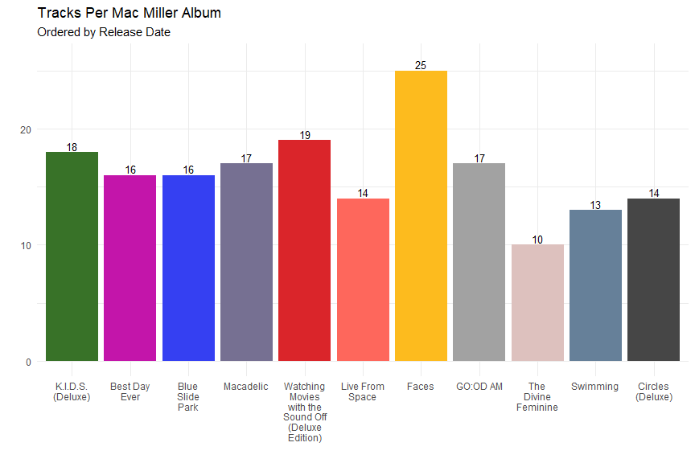

From this plot we can see that Mac's earlier albums tended to have a couple
more songs than his later releases, with *Faces* being the outlier of the
discography as a whole. This could partly be due to *Faces* originally being
released as a mixtape rather than a formal album, so perhaps it did not go
through the same revision processes that an album might see before release.

#### Duration {.tabset .tabset-fade}

Let's also take a look at track duration trends for each album, as well as each
album's total runtime.

##### Overview


```r
df %>%
  group_by(album_name) %>%
  ggplot(aes(
    x = stringr::str_wrap(album_name, 9) %>% reorder(album_release_date),
    y = duration_ms,
    fill = album_name)) +
  geom_boxplot() +
  geom_point(alpha = 0.4, shape = "diamond") +
  labs(x = "",
       y = "Track Duration (ms)",
       title = "Track Duration by Album") +
  scale_fill_manual(values = album_palette) +
  theme(legend.position = "none")
```

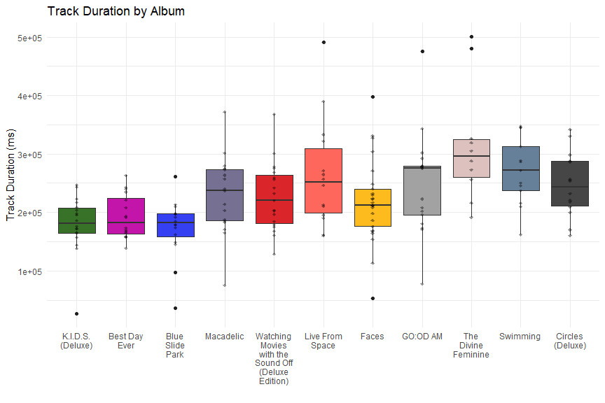

This plot tells us that even though they typically had fewer tracks on them, 
Mac's later albums contained tracks that, on average, were longer than tracks on
earlier albums. This can almost be thought of as a focus on "quality over
quantity" when it comes to the later albums. Furthermore, the plot shows that
earlier albums had less variation in track duration, while later albums saw
more variety. It is interesting to see how *The Divine Feminine*, the album
with the fewest tracks, not only contains the longest track in the dataset, but
also two tracks that are significantly longer than the rest of the album. This
could very well be an example of careful song selection to help each album
maintain a relatively similar total runtime. We'll examine that below.


```r
df %>%
  group_by(album_name) %>%
  summarise(album_name, 
            runtime = sum(duration_ms), 
            album_release_date,
            .groups = "keep") %>%
  ggplot(aes(
    x = stringr::str_wrap(album_name, 9) %>% reorder(album_release_date),
    y = runtime,
    fill = album_name)) +
  geom_col() +
  labs(x = "",
       y = "Runtime (ms)",
       title = "Total Album Runtimes") +
  scale_fill_manual(values = album_palette) +
  theme(legend.position = "none")
```

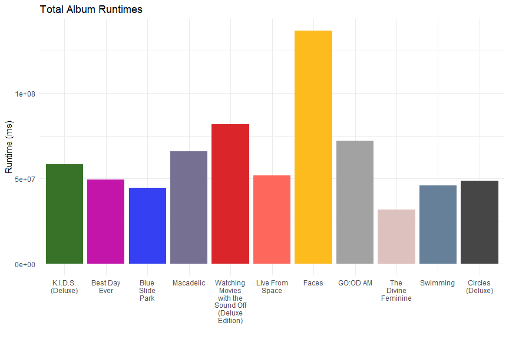

By comparing this plot with the information about each album's number of tracks,
we can see that there is a very clear correlation between number of tracks and
album runtime. For example, even though *K.I.D.S.* has a lower average track
duration than *Swimming*, the total runtime is still longer for *K.I.D.S.*, due
to the difference in track count. Generally, longer albums are subject to a bit
more criticism, as too long of a runtime can start to make the listener become
disinterested if the music doesn't provide enough variation. Knowing this, it
again makes sense that *Faces* has such a higher runtime than any other work, as
it's original release as a mixtape meant that it didn't go through the same
revisions and polishing processes that formal albums do. This runtime plot also
confirms our previous theory of Mac's later albums revolving more around the
substance of each individual track rather than making a longer, less focused 
album. We can also see from the plot that the concept of keeping longer songs
on *The Divine Feminine* does not really appear to have had a substantial 
impact on the album's total runtime, as it is still significantly shorter than
all other works.


```r
album_trends <- df %>%
  group_by(album_name) %>%
  summarise(
    album_name,
    album_release_date,
    average_track_length = mean(duration_ms),
    track_count = n(),
    .groups = "keep") %>%
  ggplot(
    aes(
      x = stringr::str_wrap(album_name, 9) %>% reorder(album_release_date),
    )
  )

avg_track_len_plot <- album_trends +
  geom_line(aes(y = average_track_length, group = 1)) +
  geom_point(aes(y = average_track_length)) +
  geom_smooth(
    aes(y = average_track_length, group = 1), 
    method = "lm",
    formula = y ~ x,
    alpha = 0.5,
    lty = "dotted",
    se = FALSE) +
  labs(x = "",
       y = "Average Duration (ms)",
       title = "Average Track Duration Trend") +
  scale_y_continuous(
    breaks = c(2e+05, 2.4e+05, 2.8e+05, 3.2e+05),
    labels = c("200K", "240K", "280K", "320K"))

total_tracks_plot <- album_trends +
  geom_line(aes(y = track_count, group = 1)) +
  geom_point(aes(y = track_count)) +
  geom_smooth(
    aes(y = track_count, group = 1), 
    method = "lm",
    formula = y ~ x,
    alpha = 0.5,
    lty = "dotted",
    se = FALSE) +
  labs(x = "",
       y = "Tracks Per Album",
       title = "Tracks per Album Trend")

avg_track_len_plot
total_tracks_plot
```

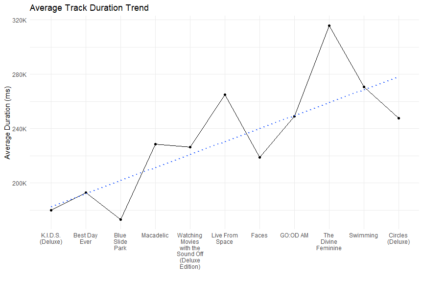

While not too severe, these plots reveal that over the course of his career,
Mac's albums tended to contain less songs, but those songs were of longer
duration.

##### Album-Specific


```r
album_names <- arrange(df, df$album_release_date) %>% 
  .$album_name %>% 
  unique()

figures = list()

for(i in album_names){
  
  figures[[i]] <- df %>%
    filter(album_name == i) %>%
    ggplot(
      aes(x = reorder(fct_inorder(track_name), desc(fct_inorder(track_name))), 
          y = duration_ms, fill = i)) +
    geom_col() +
    labs(x = "",
         y = "Track Duration (ms)",
         title = i) +
    scale_y_continuous(limits = c(0, 5.5e+05)) +
    coord_flip() +
    #ggthemes::theme_clean() +
    scale_fill_manual(values = album_palette) +
    theme(legend.position = "none",
          plot.title.position = "plot")
  
}

aligned_figs <- cowplot::align_plots(plotlist = figures, align = "v")

lapply(aligned_figs, function(x) {cowplot::ggdraw(x)})
```

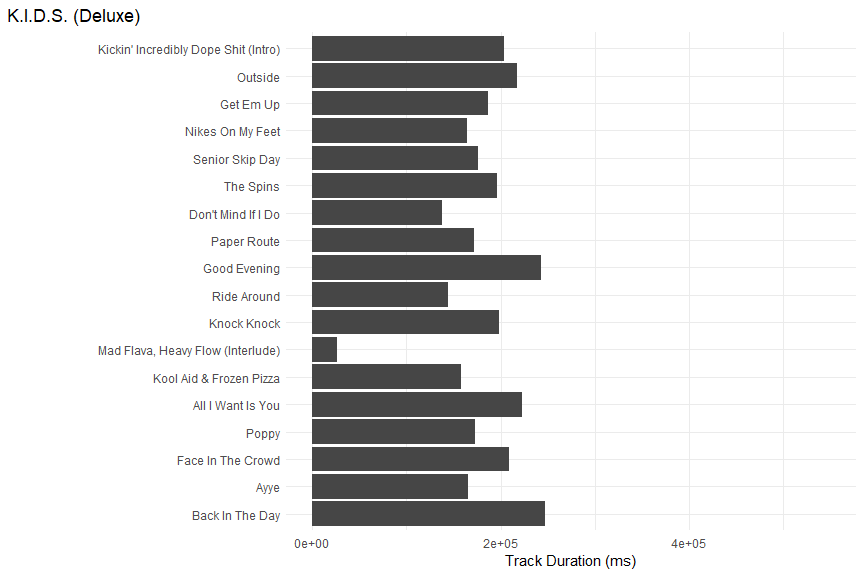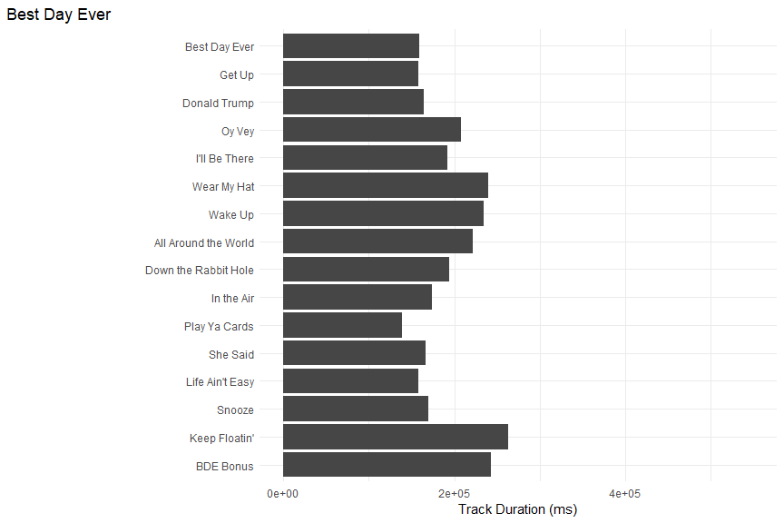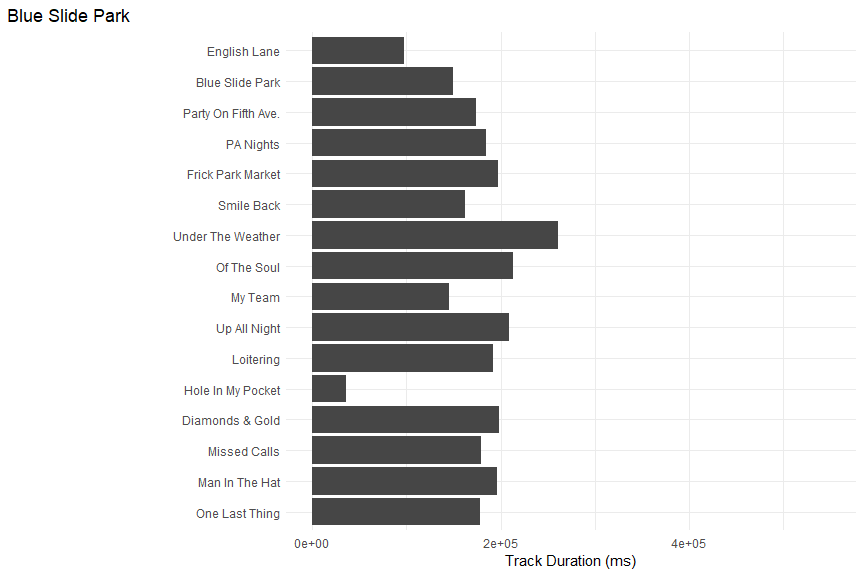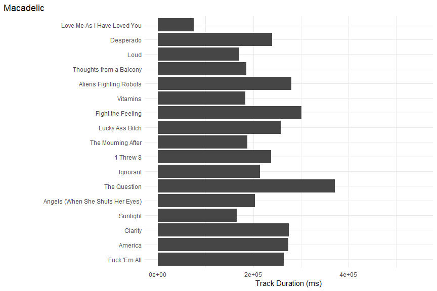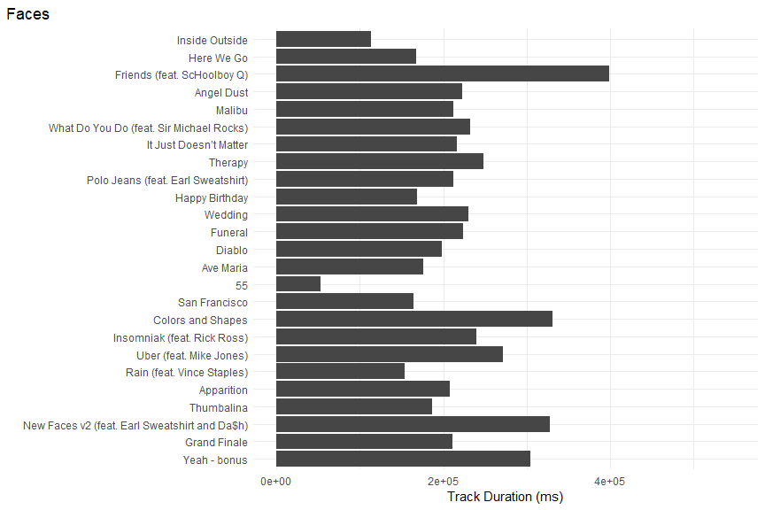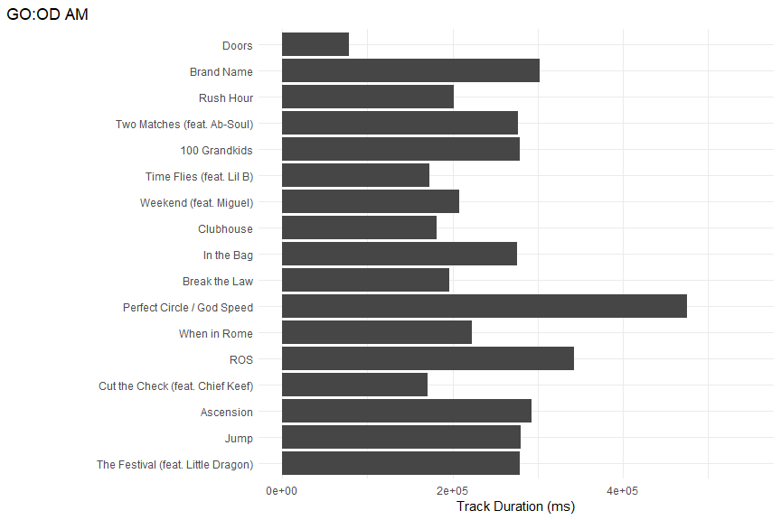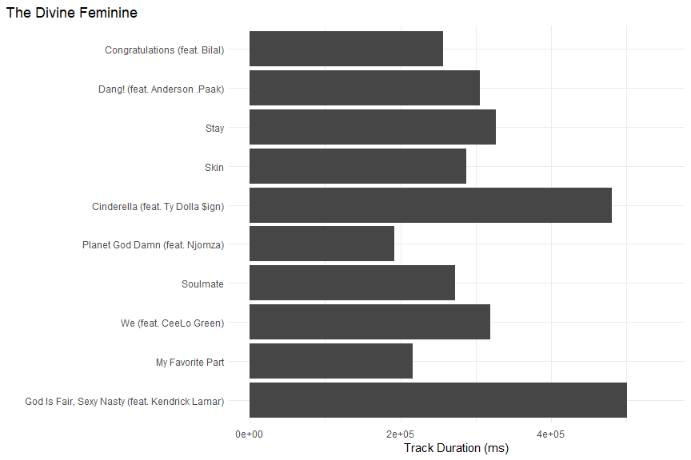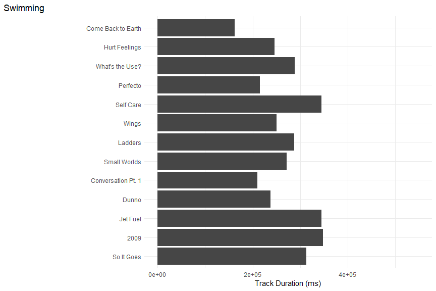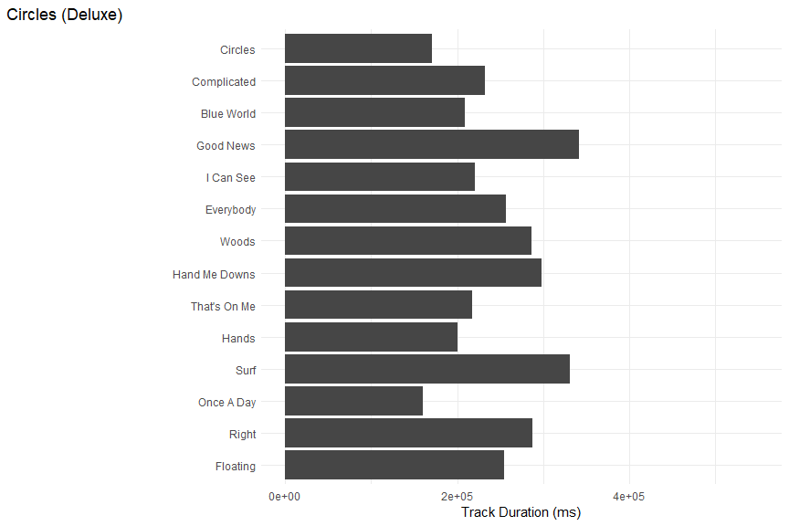

#### Explicitness

Let's take a quick look at the proportion of explicit and non-explicit (clean)
tracks on each album.


```r
exp_plot <- df %>%
  group_by(album_name, album_release_date) %>%
  count(explicit) %>%
  ggplot(
    aes(
      x = stringr::str_wrap(album_name, 9) %>% reorder(album_release_date),
      y = n,
      fill = explicit
    )
  ) + 
  geom_col(position = "fill", color = "black", alpha = 0.8, width = 0.95) +
  labs(x = "",
       y = "",
       title = "Proportion of Explicit Tracks",
       subtitle = "Per Album, ordered by Release Date",
       fill = "Explicit") +
  scale_y_continuous(labels = scales::percent) +
  scale_fill_manual(
    values = c("FALSE" = "lightgreen", "TRUE" = "coral")
  ) +
  theme(legend.position = c(0.725, 1.1),
        legend.direction = "horizontal",
        legend.box.background = element_rect(color = "lightgrey"))

exp_table <- df %>%
  group_by(album_name) %>%
  summarise(n_tracks = n(),
            n_explicit = sum(explicit == TRUE),
            prop_explicit = round(n_explicit / n_tracks, 2),
            album_release_date,
            .groups = "keep") %>%
  arrange(album_release_date) %>%
  distinct() %>%
  select("Album Name" = album_name,
         "Track Count" = n_tracks,
         "Explicit Tracks" = n_explicit,
         "Prop. Explicit" = prop_explicit)

exp_plot
```

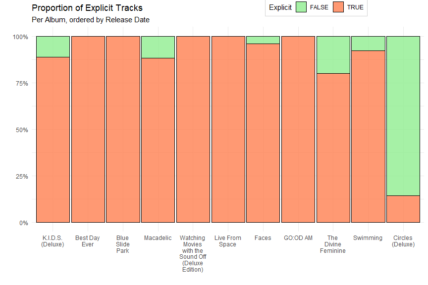

```r
exp_table
```

```
## # A tibble: 11 x 4
##    `Album Name`                  `Track Count` `Explicit Trac~` `Prop. Explicit`
##    <chr>                                 <int>            <int>            <dbl>
##  1 K.I.D.S. (Deluxe)                        18               16             0.89
##  2 Best Day Ever                            16               16             1   
##  3 Blue Slide Park                          16               16             1   
##  4 Macadelic                                17               15             0.88
##  5 Watching Movies with the Sou~            19               19             1   
##  6 Live From Space                          14               14             1   
##  7 Faces                                    25               24             0.96
##  8 GO:OD AM                                 17               17             1   
##  9 The Divine Feminine                      10                8             0.8 
## 10 Swimming                                 13               12             0.92
## 11 Circles (Deluxe)                         14                2             0.14
```

Some observations from this plot and table:

* All but one of the albums contained a proportion of explicit tracks >= 0.8
* *Circles*, Mac's last album is the only work that contains more clean
tracks than explicit tracks

#### Acousticness

Per Spotify's 
[documentation](https://developer.spotify.com/documentation/web-api/reference/#/operations/get-several-audio-features),
**acousticness** is "*A confidence measure from 0.0 to 1.0 of whether or not 
the track is acoustic. 1.0 represents high confidence that the track is 
acoustic. According to 
[Wikipedia](https://en.wikipedia.org/wiki/Acoustic_music),
acoustic music is generally thought of as music that primary features
features that produce sound through physical properties, as opposed to electric
or digital amplification (think grand piano versus digital keyboard). 


```r
df %>% 
  group_by(album_name, album_release_date) %>%
  ggplot(
    aes(
      x = stringr::str_wrap(album_name, 9) %>% reorder(album_release_date),
      y = acousticness,
      fill = album_name
    )
  ) +
  geom_boxplot() +
  labs(x = "",
       y = "",
       title = "Summary of Acousticness",
       subtitle = "Per Album, ordered by Release Date") +
  theme(legend.position = "none") +
  scale_fill_manual(values = album_palette)

df %>%
  group_by(album_name, album_release_date) %>%
  ggplot(
    aes(
      y = stringr::str_wrap(album_name, 28) %>% reorder(album_release_date),
      x = acousticness,
      fill = album_name
    )
  ) +
  ggridges::geom_density_ridges2() +
  labs(x = "",
       y = "",
       title = "Density of Acousticness Measures",
       subtitle = "Per Album") +
  scale_fill_manual(values = album_palette) +
  theme(legend.position = "none")
```

```
## Picking joint bandwidth of 0.12
```

```r
df %>%
  group_by(album_name, album_release_date) %>%
  summarise(
    avg_acousticness = mean(acousticness)
  ) %>%
  ggplot(aes(x = album_release_date, y = avg_acousticness)) +
  geom_line(color = "lightblue", size = 1.5) +
  geom_point() +
  ggrepel::geom_text_repel(aes(label = album_name), force = ) +
  labs(y = "Acousticness",
       x = "Album Release Year",
       title = "Average Acousticness Per Album",
       subtitle = "Ordered by Release Date")
```

```
## `summarise()` has grouped output by 'album_name'. You can override using the
## `.groups` argument.
```

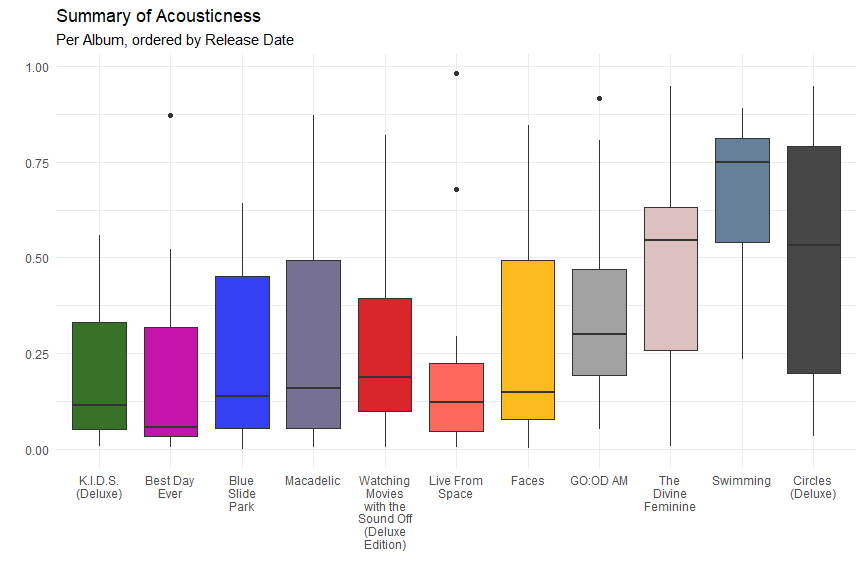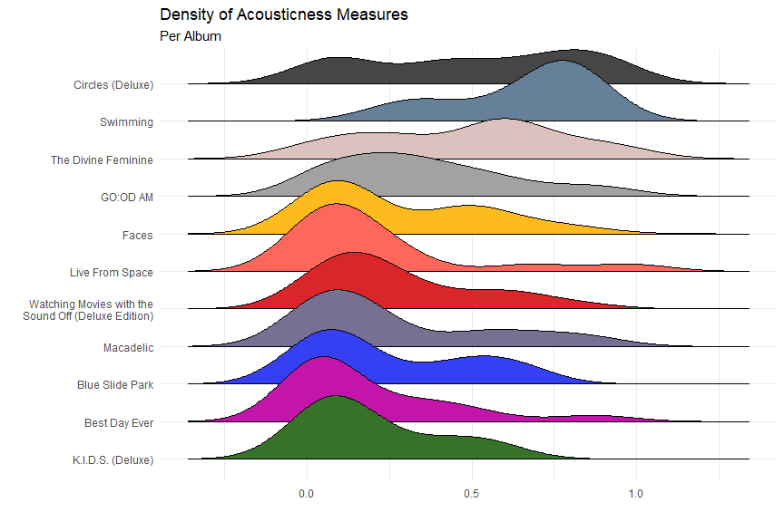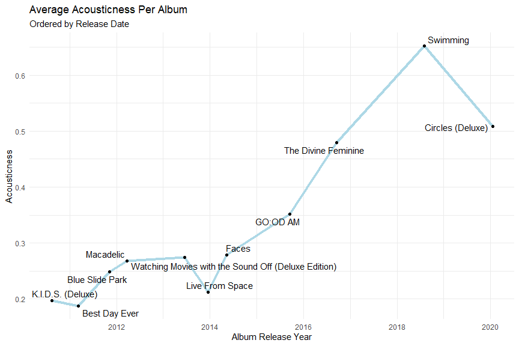

From these plots we can see a clear trend of increasing **acousticness** towards
the later works of Mac's career. We can also see greater variation in the 
values of later albums, suggesting the possibility of more distinct sonic 
changes from album to album later in his career.

### Measure Distributions

This section will focus on displaying some simple yet informative information
regarding Spotify's quantitative metrics:

* **acousticness**
* **danceability**
* **energy**
* **instrumentalness**
* **liveness**
* **speechiness**
* **valence**


```r
measures <- c(
  "acousticness",
  "danceability",
  "energy",
  "instrumentalness",
  "liveness",
  "speechiness",
  "valence"
)

df %>%
  select(all_of(measures)) %>%
  gather() %>%
  mutate(key = factor(key)) %>%
  filter(value > 0.1) %>%
  ggplot(aes(x = value, color = key)) +
  geom_density(size = 1.25) +
  labs(x = "Value",
       y = "Density",
       color = "Measure",
       title = "Spotify Measure Density Plot") +
  scale_color_brewer(type = "qual", palette = 7)
```

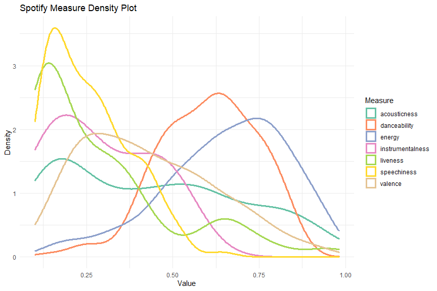

From this plot, we can see that **danceability** and **energy** seem to have
very similar density curves. It is definitely worth investigating if there is
any correlation between those two measures. Additionally, within the code to
construct the plot, you'll notice there is a `filter()` statement to set the
lower limit of the values to 0.1. This was done to exclude the enormous amount
of **instrumentalness** observations that lie between 0 and 0.1, which stretched
the y-axis by far too much for the rest of the density curves to be observed.

### Multivariate Plots

Here we will be investigating some of the questions posed above by looking at
the interaction between specific variables.

#### 
