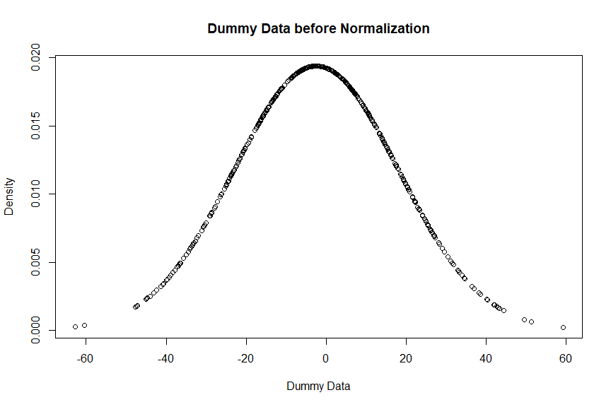
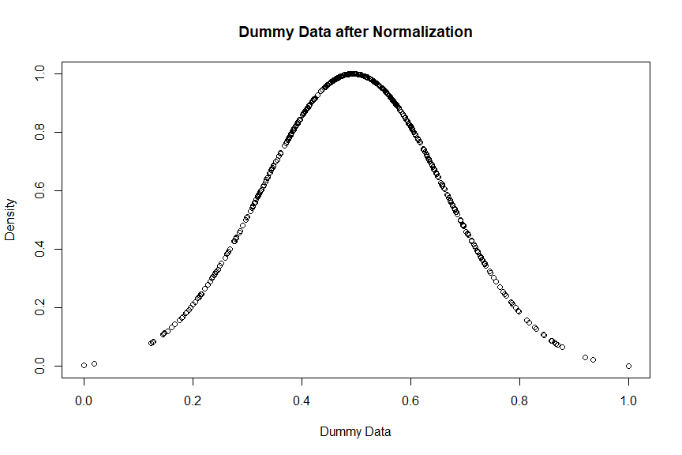

# Welcome!

This is the third and final section of my introductory look at exploring the
Spotify API using R. If you haven't already read through sections one and two,
where we cover accessing, cleaning, and visualizing the data, I'd strongly
recommend you begin with those before reading this section. If you're coming
from there, welcome back, and let's continue!

In this section we will be applying a clustering algorithm to the data we've 
collected to see if any interesting patterns emerge in the results. We'll be
using k-means clustering, probably the most common clustering algorithm out,
and for good reason! It's simple, easy to interpret, and not too computationally
expensive. All around, a very good place to start, so let's go ahead and dive 
right in!

# Standarding the Data

Before we can actually apply the clustering, we first need to ensure that all
of the data we'll be working with has been scaled to have the same range. This
helps the clustering algorithm treat each variable equally instead of weighting
certain variables higher or lower when determining what cluster an observation
should be placed in. To do this, we'll be applying a technique called min-max
normalizing, which will preserve the distribution of the measurements while
transforming them to fall within the 0 to 1 range. 


```r
df <- read_csv("section-two-end-df.csv", show_col_types = F)
```


```r
min_max <- function(x, na.rm = TRUE){
  return((x - min(x)) / (max(x) - min(x)))
}
```

To check if our function does indeed retain the original distribution, we can
use some dummy data to perform a quick analysis.


```r
dummy_data <- rnorm(500, mean = -3, sd = 20)
y <- dnorm(dummy_data, mean(dummy_data), sd(dummy_data))
plot(x = dummy_data, y = y,
     xlab = "Dummy Data",
     ylab = "Density",
     main = "Dummy Data before Normalization")
```




```r
dummy_data <- min_max(dummy_data)
y <- min_max(y)

plot(x = dummy_data, y = y,
     xlab = "Dummy Data",
     ylab = "Density",
     main = "Dummy Data after Normalization")
```



As you can see, the distribution of points is exactly the same. However, pay
special attention to the axes. Both the y and x axis range from 0 to 1 exactly.
This means our normalization function works as expected!


```r
# recode TRUE/FALSE to binary indicator (1 == TRUE)
df$explicit <- ifelse(df$explicit == TRUE, 1, 0)

# normalize the numeric columns in the dataset
df[,5:17] <- df[,5:17] %>% apply(., 2, function(x) min_max(x))

# check the results of the normalization
summary(df[,5:17])
```

```
##   acousticness      danceability    instrumentalness       liveness     
##  Min.   :0.00000   Min.   :0.0000   Min.   :0.0000000   Min.   :0.0000  
##  1st Qu.:0.06319   1st Qu.:0.4986   1st Qu.:0.0000000   1st Qu.:0.0564  
##  Median :0.20364   Median :0.6431   Median :0.0000000   Median :0.1360  
##  Mean   :0.32212   Mean   :0.6295   Mean   :0.0278628   Mean   :0.2238  
##  3rd Qu.:0.54982   3rd Qu.:0.7718   3rd Qu.:0.0005535   3rd Qu.:0.3160  
##  Max.   :1.00000   Max.   :1.0000   Max.   :1.0000000   Max.   :1.0000  
##     loudness       speechiness        valence        duration_ms    
##  Min.   :0.0000   Min.   :0.0000   Min.   :0.0000   Min.   :0.0000  
##  1st Qu.:0.7431   1st Qu.:0.1114   1st Qu.:0.2222   1st Qu.:0.3169  
##  Median :0.8183   Median :0.2389   Median :0.3730   Median :0.3942  
##  Mean   :0.7925   Mean   :0.2915   Mean   :0.4027   Mean   :0.4245  
##  3rd Qu.:0.8749   3rd Qu.:0.4422   3rd Qu.:0.5633   3rd Qu.:0.5160  
##  Max.   :1.0000   Max.   :1.0000   Max.   :1.0000   Max.   :1.0000  
##     explicit           key               mode            tempo       
##  Min.   :0.0000   Min.   :0.00000   Min.   :0.0000   Min.   :0.0000  
##  1st Qu.:1.0000   1st Qu.:0.09091   1st Qu.:0.0000   1st Qu.:0.2366  
##  Median :1.0000   Median :0.45455   Median :1.0000   Median :0.4638  
##  Mean   :0.8883   Mean   :0.43677   Mean   :0.6034   Mean   :0.4604  
##  3rd Qu.:1.0000   3rd Qu.:0.72727   3rd Qu.:1.0000   3rd Qu.:0.6615  
##  Max.   :1.0000   Max.   :1.00000   Max.   :1.0000   Max.   :1.0000  
##  time_signature  
##  Min.   :0.0000  
##  1st Qu.:0.7500  
##  Median :0.7500  
##  Mean   :0.7388  
##  3rd Qu.:0.7500  
##  Max.   :1.0000
```

Excellent! As we can see from the `summary()` readout, each of our numeric
columns now has a minimum of 0 and a maximum of 1. This means each variable
will carry equal weighting in the clustering, which is exactly what we wanted
to achieve.


```r
library(factoextra)
```

# Applying the Clustering

When using k-means clustering, the user needs to predetermine the number of 
clusters they'd like the algorithm to sort into. This decision can have a very
significant impact on the efficacy of the clustering, and as should typically
be chosen after considering a couple different values. A common method for 
determining the optimal number of clusters (also known as k-value) is using
an [elbow plot](https://uc-r.github.io/kmeans_clustering). This sort of plot
shows the total WSS (within-cluster sum of square) variation for each value of
k considered. The idea is to pick the k-value where the plot "bends" (aka the
point of the elbow). The k-value associated with this point is the number of 
clusters that produces the lowest total WSS without passing into the realm of
diminishing returns. Theoretically, it is possible to have a total WSS of 0.
However, this is only the case when $k = n$, where $n = # of Observations$. 
This extreme case is basically useless, as each observation would be placed into
its own cluster. For this project, we'll consider k-values ranging from 2 to 15.


```r
set.seed(333)

fviz_nbclust(df[,5:17], 
             kmeans, 
             method = "wss",
             k.max = 15)
```


While not always incredibly easy to interpret, I would say that k = 6 is the
most reasonable choice based on the elbow plot.


```r
set.seed(333)
clustering <- kmeans(df[,5:17],
                     centers = 6,
                     nstart = 25,
                     iter.max = 25)
set.seed(NULL)

print(clustering)
```

```
## K-means clustering with 6 clusters of sizes 47, 36, 27, 12, 49, 8
## 
## Cluster means:
##   acousticness danceability instrumentalness   liveness  loudness speechiness
## 1    0.2954039    0.6126442     0.0008439931 0.18545012 0.8142937   0.2787238
## 2    0.2855961    0.6451332     0.0194830041 0.17219677 0.8346810   0.3586581
## 3    0.3073129    0.6020789     0.0054516369 0.36752199 0.8012884   0.2767026
## 4    0.5199940    0.7143506     0.1924886883 0.07833352 0.6913512   0.1530466
## 5    0.2821350    0.6180559     0.0263117800 0.25254072 0.8014190   0.3135901
## 6    0.6414995    0.6939714     0.0625051440 0.23920039 0.5429003   0.1868393
##     valence duration_ms explicit       key mode     tempo time_signature
## 1 0.3851198   0.4109324        1 0.7253385    1 0.4502752      0.7500000
## 2 0.4702086   0.4482582        1 0.7196970    0 0.5244147      0.7500000
## 3 0.4155077   0.4573393        1 0.1919192    0 0.3626028      0.7407407
## 4 0.4151471   0.4243565        0 0.3484848    1 0.3578139      0.7291667
## 5 0.3807969   0.4128689        1 0.1280148    1 0.4949982      0.7244898
## 6 0.2747636   0.3583951        0 0.3181818    0 0.5029151      0.7187500
## 
## Clustering vector:
##   [1] 5 2 5 1 2 1 2 3 5 2 5 5 5 2 4 5 2 5 2 5 1 3 3 5 1 4 4 1 6 6 6 4 4 4 5 6 6
##  [38] 4 4 6 1 3 5 5 1 1 1 2 5 2 2 5 3 2 1 2 2 2 4 3 4 5 1 5 3 5 1 3 3 5 5 1 1 1
##  [75] 1 1 2 1 3 2 2 5 2 2 1 3 5 2 1 2 3 5 1 3 5 2 3 5 5 1 3 3 5 5 3 5 5 1 5 1 1
## [112] 5 5 5 2 3 5 2 5 2 2 1 5 3 1 1 5 2 6 2 5 1 1 5 2 3 1 1 5 1 1 2 4 2 5 1 3 1
## [149] 3 1 5 1 3 1 3 5 5 2 1 1 1 5 1 2 2 3 2 1 5 1 5 3 6 1 5 4 3 2 1
## 
## Within cluster sum of squares by cluster:
## [1] 16.097974 13.218403 11.123980  5.801803 19.191278  5.027669
##  (between_SS / total_SS =  52.9 %)
## 
## Available components:
## 
## [1] "cluster"      "centers"      "totss"        "withinss"     "tot.withinss"
## [6] "betweenss"    "size"         "iter"         "ifault"
```


```r
fviz_cluster(clustering, data = df[,5:17])
```


From this visualization, we can see that there is quite a bit of overlap towards
the left-hand side of the plot. Let's generate some visualizations using a lower
k-value and see how they differ.


```r
set.seed(333)

k2 <- kmeans(df[,5:17], centers = 2, nstart = 25)
k3 <- kmeans(df[,5:17], centers = 3, nstart = 25)
k4 <- kmeans(df[,5:17], centers = 4, nstart = 25)
k5 <- kmeans(df[,5:17], centers = 5, nstart = 25)

plot2 <- fviz_cluster(k2, data = df[,5:17])
plot3 <- fviz_cluster(k3, data = df[,5:17])
plot4 <- fviz_cluster(k4, data = df[,5:17])
plot5 <- fviz_cluster(k5, data = df[,5:17])

gridExtra::grid.arrange(plot2, plot3, plot4, plot5, nrow = 2)
```


These plots don't look too different than our k = 6 plot. Furthermore, our
`print(clustering)` statement from before told us that our 
$between\_ss \ /\  total\_ss = 52.9%$. A value this low tends to indicate that
the k-means clustering simply didn't work with the data. Sure, clusters were
created, but they're so loosely defined that they aren't worth keeping. It's
very possible that we are feeding too many variables into the algorithm. To
overcome this, we can use a technique called *Principal Component Analysis*, or
PCA for short. 

# Principal Component Analysis

When working with data, it is not uncommon for the majority of information in
the dataset to be contained within just a few different variables, or at least
in their interactions. In other words, when working with high dimensionality
data, it is commonly possible for most of the information within that data to
be stored using far fewer dimensions. However, figuring out how to effectively
maintain that information while shrinking the size of its representation is not
always an easy task. Analyzing correlations between variables is a great place
to start, as covered at the end of section two of this series. However, that
is not always enough. This is where PCA comes in.

Principal component analysis is the process of computing the principal
components of a collection of observations, and using them to perform a change
of basis on that data in order to reduce the number of features in the data.
To remove features, PCA calculates the amount of variance in the data that can
be explained by the $i^{th}$ variable in the set. The first principal component
explains the greatest amount of variation, and so on until all variables have 
been assessed. Once that is done, it is typically up to the user to decide how
many of those variables within the set of *i* variables to retain in their new
set. Often, an elbow plot is used to help guide said decision.


```r
inputs <- df[,5:17] # create input matrix of only numeric variables

inputs_pca <- prcomp(inputs, 
                     center = TRUE, 
                     scale. = FALSE) # data is already normalized

summary(inputs_pca)
```

```
## Importance of components:
##                           PC1    PC2    PC3     PC4     PC5     PC6     PC7
## Standard deviation     0.4942 0.3810 0.3203 0.27000 0.25625 0.23799 0.21203
## Proportion of Variance 0.2904 0.1726 0.1220 0.08669 0.07809 0.06735 0.05346
## Cumulative Proportion  0.2904 0.4630 0.5849 0.67164 0.74973 0.81708 0.87054
##                            PC8     PC9    PC10    PC11    PC12    PC13
## Standard deviation     0.19149 0.16987 0.12962 0.11792 0.08770 0.07031
## Proportion of Variance 0.04361 0.03431 0.01998 0.01654 0.00915 0.00588
## Cumulative Proportion  0.91415 0.94846 0.96844 0.98497 0.99412 1.00000
```

This tells us that by just using the first two principal components, we are able
to explain 46.3% of the variation in the data. We can further analyze the 
results of the PCA using a biplot.


```r
album_palette = c(
  "K.I.D.S. (Deluxe)" = "#387228",
  "Best Day Ever" = "#C315AA",
  "Blue Slide Park" = "#3540F2",
  "Macadelic" = "#767092",
  "Watching Movies with the Sound Off (Deluxe Edition)" = "#DA252A",
  "Live From Space" = "#FE675C",
  "Faces" = "#FDBB1E",
  "GO:OD AM" = "#A2A2A2",
  "The Divine Feminine" = "#DDC1BE",
  "Swimming" = "#668099",
  "Circles (Deluxe)" = "#464646"
  )

library(ggbiplot)
biplot <- ggbiplot(inputs_pca,
                   obs.scale = 1,
                   var.scale = 1,
                   groups = factor(df$album_name),
                   ellipse = TRUE,
                   circle = TRUE,
                   ellipse.prob = 0.68)

biplot <- biplot + 
  scale_color_manual(values = album_palette, name = "") +
  theme(legend.position = "none")

print(biplot)
```


This biplot tells us that **mode** is highly negatively correlated with PC1, as
indicated by the arrow pointing nearly horizontally to the left. We can also see
that **acousticness** and **instrumentalness** are influenced similarly by PC2.
This makes sense, as those two measures both deal with the presence of
non-electric (acoustic) instruments in a track's sound. We can also see that
the majority of the observations fall into two relatively neat clusters when
mapped using PC1 and PC2. The circles around them represent album groupings. 
These circles tell us that there is a great deal of overlap between most of the
albums' measures, with *Circles* containing most of the outliers up at the top.


```r
library(dplyr)
library(FactoMineR)
```


```r
new_inputs_pca <- PCA(inputs,
                      scale.unit = FALSE,
                      graph = F,
                      ncp = 10)

new_inputs_pca$eig
```

```
##          eigenvalue percentage of variance cumulative percentage of variance
## comp 1  0.242833195             29.0390127                          29.03901
## comp 2  0.144330163             17.2596067                          46.29862
## comp 3  0.101993865             12.1968544                          58.49547
## comp 4  0.072491758              8.6688686                          67.16434
## comp 5  0.065298308              7.8086458                          74.97299
## comp 6  0.056320724              6.7350685                          81.70806
## comp 7  0.044704515              5.3459536                          87.05401
## comp 8  0.036463895              4.3605056                          91.41452
## comp 9  0.028693799              3.4313249                          94.84584
## comp 10 0.016707349              1.9979349                          96.84378
## comp 11 0.013828588              1.6536806                          98.49746
## comp 12 0.007649052              0.9147057                          99.41216
## comp 13 0.004915683              0.5878380                         100.00000
```

In order to tolerate no more than 15% information loss, we have to use 7 
principal components (cumulative variance prop. of 87.05401). 


```r
plot.PCA(new_inputs_pca,
         choix = "ind",
         habillage = 9,
         select = "contrib 5",
         invisible = "quali")
```


From this plot we find 5 row IDs that are considered to be outliers:

note: really, these are simply the 5 observations farthest from the origin
of the PCA plot, but they are worth exploring to identify potential similarities
among them)

* 29
* 36
* 37
* 40
* 129

Let's take a quick look at those observations to see what values stand out.


```r
print(df[c(29, 36, 37, 40, 129),])
```

```
## # A tibble: 5 x 17
##   track_name   artist_name album_name album_release_d~ acousticness danceability
##   <chr>        <chr>       <chr>      <date>                  <dbl>        <dbl>
## 1 Good News    Mac Miller  Circles (~ 2020-01-17              0.869        0.890
## 2 Surf         Mac Miller  Circles (~ 2020-01-17              0.769        0.936
## 3 Once A Day   Mac Miller  Circles (~ 2020-01-17              0.965        0.846
## 4 Come Back t~ Mac Miller  Swimming   2018-08-03              0.907        0.178
## 5 Love Me As ~ Mac Miller  Macadelic  2012-03-23              0.790        0.317
## # ... with 11 more variables: instrumentalness <dbl>, liveness <dbl>,
## #   loudness <dbl>, speechiness <dbl>, valence <dbl>, duration_ms <dbl>,
## #   explicit <dbl>, key <dbl>, mode <dbl>, tempo <dbl>, time_signature <dbl>
```

Unsurprisingly, 3/5 points come from the *Circles* album, which has
consistently had the most distinct sound in the dataset. *Good News* and *Surf*
in particular have much higher **instrumentalness** values than the other 
observations. It is very likely that this plays a role in them being grouped
outside the majority of the observations. Additionally, all 3 of the points
from *Circles* have pretty high **danceability** measures. All 5 of the points
have fairly similar **acousticness** measures. This seems like the most likely
contributor for these points being grouped so closely in the above plot.


```r
# get principal component descriptions
pca_dimdesc <- dimdesc(new_inputs_pca)

# get info of PC1 influential features
pca_dimdesc$Dim.1
```

```
## $quanti
##      correlation       p.value
## mode   0.9961527 4.293355e-189
## key   -0.1625311  2.972333e-02
## 
## attr(,"class")
## [1] "condes" "list"
```

The first principal component gets its information from the **mode** and **key**
variables, both of which can be thought of as factor variables rather than
quantitative measures. This is important knowledge, as it tells us that our
data is being assessed largely by a set of factors. That's not really what we
want, as we want our clustering to be based more so on the quantitative measures
within the set. Let's create a new set of input variables that contains only
the quantitative measures. Additionally, we'll pull the **energy** variable back
to see if we were perhaps too eager to drop that variable from the set.


```r
# read in fresh dataset (includes energy variable)
df <- read_csv("working-data.csv", show_col_types = FALSE)

# example observations from freshly read in dataframe
print(df[sample(1:nrow(df), 10),])
```

```
## # A tibble: 10 x 18
##    track_name  artist_name album_name album_release_d~ acousticness danceability
##    <chr>       <chr>       <chr>      <date>                  <dbl>        <dbl>
##  1 Grand Fina~ Mac Miller  Faces      2014-05-11             0.188         0.613
##  2 Friends (f~ Mac Miller  Faces      2014-05-11             0.149         0.557
##  3 O.K. - Bon~ Mac Miller  Watching ~ 2013-06-18             0.0579        0.814
##  4 I Am Who A~ Mac Miller  Watching ~ 2013-06-18             0.611         0.368
##  5 Red Dot Mu~ Mac Miller  Watching ~ 2013-06-18             0.156         0.537
##  6 Come Back ~ Mac Miller  Swimming   2018-08-03             0.89          0.272
##  7 Kool Aid &~ Mac Miller  K.I.D.S. ~ 2010-08-13             0.154         0.66 
##  8 New Faces ~ Mac Miller  Faces      2014-05-11             0.0536        0.479
##  9 Uber (feat~ Mac Miller  Faces      2014-05-11             0.391         0.537
## 10 Ascension   Mac Miller  GO:OD AM   2015-09-18             0.346         0.756
## # ... with 12 more variables: energy <dbl>, instrumentalness <dbl>,
## #   liveness <dbl>, loudness <dbl>, speechiness <dbl>, valence <dbl>,
## #   duration_ms <dbl>, explicit <lgl>, key <dbl>, mode <dbl>, tempo <dbl>,
## #   time_signature <dbl>
```


```r
# selecting desired variables for fresh input matrix
inputs <- select(df, 
                 acousticness,
                 danceability,
                 energy,
                 instrumentalness,
                 liveness,
                 loudness,
                 speechiness,
                 valence,
                 duration_ms,
                 tempo)

# input matrix summary statistics
summary(inputs)
```

```
##   acousticness       danceability        energy       instrumentalness  
##  Min.   :0.000283   Min.   :0.1410   Min.   :0.0316   Min.   :0.000000  
##  1st Qu.:0.062250   1st Qu.:0.5070   1st Qu.:0.5355   1st Qu.:0.000000  
##  Median :0.200000   Median :0.6130   Median :0.6700   Median :0.000000  
##  Mean   :0.316191   Mean   :0.6031   Mean   :0.6441   Mean   :0.013541  
##  3rd Qu.:0.539500   3rd Qu.:0.7075   3rd Qu.:0.7845   3rd Qu.:0.000269  
##  Max.   :0.981000   Max.   :0.8750   Max.   :0.9640   Max.   :0.486000  
##     liveness         loudness        speechiness        valence      
##  Min.   :0.0593   Min.   :-25.426   Min.   :0.0261   Min.   :0.0546  
##  1st Qu.:0.1110   1st Qu.: -8.411   1st Qu.:0.0946   1st Qu.:0.2520  
##  Median :0.1840   Median : -6.687   Median :0.1730   Median :0.3860  
##  Mean   :0.2645   Mean   : -7.278   Mean   :0.2053   Mean   :0.4124  
##  3rd Qu.:0.3490   3rd Qu.: -5.392   3rd Qu.:0.2980   3rd Qu.:0.5550  
##  Max.   :0.9760   Max.   : -2.527   Max.   :0.6410   Max.   :0.9430  
##   duration_ms         tempo       
##  Min.   : 26882   Min.   : 57.75  
##  1st Qu.:177096   1st Qu.: 89.50  
##  Median :213772   Median :119.97  
##  Mean   :228138   Mean   :119.52  
##  3rd Qu.:271508   3rd Qu.:146.50  
##  Max.   :500960   Max.   :191.92
```


```r
inputs <- scale(inputs) # we use z-score scaling here to minimize outlier impact
```

# Clustering (Take 2)

Now that we're working with a different set of input variables, and have changed
our scaling method, let's try apply the k-means algorithm once again and see
if our results are more promising this time around.


```r
# elbow plot using refreshed input matrix
fviz_nbclust(inputs,
             kmeans,
             method = "wss",
             k.max = 20)
```


The ideal number of clusters according to the above plot looks to be 8. Using
this information, we'll fit a model with 8 centers, being sure to set the 
`nstart` parameter to 25 to allow the function to generate 25 initial clustering
assignments and choose the path that led to the best result.


```r
# set seed for reproducability
set.seed(92)

# fit clustering model
cluster <- kmeans(inputs,
                  centers = 8,
                  iter.max = 25,
                  nstart = 25)

# display clustering result summary
print(cluster)
```

```
## K-means clustering with 8 clusters of sizes 31, 28, 3, 8, 19, 36, 32, 22
## 
## Cluster means:
##   acousticness danceability     energy instrumentalness   liveness   loudness
## 1   -0.6507592   -0.2822368  0.3325601      -0.21000389 -0.0820386  0.4968437
## 2   -0.4953759   -0.2603073  0.5845352      -0.21197583 -0.0930008  0.4233821
## 3    0.9265287   -1.0158538 -1.6038969       6.73344078 -0.6951598 -2.0411236
## 4    2.0337137   -0.7992003 -2.5460584      -0.15887378  0.2767123 -2.6929566
## 5   -0.5027570   -0.3464743  0.5740967      -0.20767645  2.1856206  0.3239495
## 6    0.7616887    0.3029581 -0.8893933       0.13742157 -0.5953219 -0.6521569
## 7   -0.3854140    0.9465725  0.4742448      -0.08821653 -0.2734088  0.4673950
## 8    0.4299819   -0.4152132  0.2017407      -0.21192198 -0.2875963  0.1261882
##   speechiness    valence duration_ms      tempo
## 1  -0.7755799 -0.7030518  -0.3448329 -0.0356124
## 2   1.0003665  0.4569917  -0.1609083  1.2326748
## 3  -1.0129883 -0.5208588  -1.3629992 -0.1676701
## 4  -1.1968806 -0.8997472  -0.7293079 -0.5509378
## 5   0.4086353  0.1506219   0.6872454  0.2402995
## 6  -0.5238471 -0.6028044   0.8572306  0.2859971
## 7  -0.1135210  1.2237454  -0.4837251 -0.6449955
## 8   1.0624464 -0.1164236  -0.1509113 -1.0328239
## 
## Clustering vector:
##   [1] 1 8 5 8 1 8 7 1 2 1 8 8 5 2 3 8 6 1 2 2 8 5 5 1 1 4 7 8 6 6 6 6 6 6 7 6 4
##  [38] 3 6 4 6 6 6 6 6 6 8 6 4 6 6 6 4 7 5 6 6 2 8 6 7 6 1 1 7 2 7 7 7 2 1 6 7 2
##  [75] 2 1 1 6 4 1 2 5 1 8 6 7 2 2 6 1 6 7 6 5 6 2 5 5 5 5 1 5 5 4 1 7 6 1 2 8 1
## [112] 5 8 7 2 8 6 2 2 2 8 6 1 5 1 2 7 2 4 2 1 8 2 1 5 5 8 8 7 6 1 7 6 7 2 1 1 7
## [149] 8 1 1 7 8 1 7 2 3 2 6 7 1 2 1 7 7 5 7 7 7 2 2 5 7 7 7 7 8 7 8
## 
## Within cluster sum of squares by cluster:
## [1] 127.02066 112.74881  26.29160  53.78308 103.78621 189.79871 130.92957
## [8]  86.51151
##  (between_SS / total_SS =  53.3 %)
## 
## Available components:
## 
## [1] "cluster"      "centers"      "totss"        "withinss"     "tot.withinss"
## [6] "betweenss"    "size"         "iter"         "ifault"
```


```r
# visualize clustering
fviz_cluster(cluster,
             geom = "point",
             data = inputs,
             palette = "Dark2",
             main = "K Means Clustering (k = 8)",
             alpha = 0.75)
```


Now that our clustering is complete, we can take the assignment vector and 
append it the original data, allowing for descriptive statistics at the cluster
level to be performed. 


```r
# append assignment vector to original dataframe
df$cluster <- cluster$cluster

# print example df with cluster column shown
print(
  select(df, track_name, album_name, cluster) %>% 
  .[sample(1:nrow(df), 10),]
)
```

```
## # A tibble: 10 x 3
##    track_name                         album_name                         cluster
##    <chr>                              <chr>                                <int>
##  1 Surf                               Circles (Deluxe)                         6
##  2 Planet God Damn (feat. Njomza)     The Divine Feminine                      2
##  3 Stay                               The Divine Feminine                      5
##  4 BDE (Best Day Ever) - Live         Live From Space                          5
##  5 The Star Room                      Watching Movies with the Sound Of~       8
##  6 The Festival (feat. Little Dragon) GO:OD AM                                 6
##  7 Blue World                         Circles (Deluxe)                         8
##  8 2009                               Swimming                                 6
##  9 Angels (When She Shuts Her Eyes)   Macadelic                                1
## 10 Jet Fuel                           Swimming                                 6
```

# Clustering Assessment

Now that our clustering assignment is complete, we should take a look at some
metrics to understand how our model performed on the data.

## Sum of Squares

The **BSS** of the model is 949.1298579.

Interpreting this value:

* Between Sum of Squares, or BSS, is a metric that reports the sum of the
  squared distance between each cluster's centroid.
* Generally speaking, **the higher the BSS, the better**, as that indicates the
  clusters are distinct and the centroids are far apart from one another
* A large BSS value suggests that characteristics of the data within each
  cluster are unique and can easily be identified from one another
* A common k-means performance metric is $BSS\ /\ TSS$, where $TSS$ is the
  **Total Sum of Squares**. To get a high value from this equation, we would
  need to raise the number of clusters. However, because we chose the number
  of clusters using the elbow plot method (at k = 8), we won't alter the model
  to optimize the $BSS\ /\ TSS$ metric, and will stay with k = 8.
  

```r
# print rounded bss / tss (as percentage)
round(cluster$betweenss / cluster$totss, 4) * 100
```

```
## [1] 53.32
```

This value essentially tells us that each cluster is roughly 53.32% different
than the other clusters. Since the goal here is to build playlists from the
clusters, this value seems like a pretty ideal result. We wouldn't want (or
expect for that matter, since all observations came from a single artist) this
value to be incredibly high, as that would mean that each playlist created would
be drastically different from the others. 

## Prediction Strength

The prediction strength of a clustering assignment refers to the 
generalizability of the model. In short, it asks the question "How well can
this clustering react to observations it hasn't seen before?". It is sometimes
used a metric for validating the choice of k. Common rule of thumb suggests that
the largest number of clusters that leads to a prediction strength of 0.8 or 0.9
should be used. Here we'll use it to assess our choice of k = 8.


```r
# create prediction strength assessment
fpc::prediction.strength(inputs,
                         Gmin = 2,
                         Gmax = 10,
                         M = 100,
                         cutoff = 0.8)
```

```
## Prediction strength 
## Clustering method:  kmeans 
## Maximum number of clusters:  10 
## Resampled data sets:  100 
## Mean pred.str. for numbers of clusters:  1 0.7389799 0.4729481 0.3684657 0.3003423 0.2375628 0.2141904 0.1846087 0.1432713 0.1492471 
## Cutoff value:  0.8 
## Largest number of clusters better than cutoff:  1
```

We see from this result that the model does not have high prediction strength at
all. In fact, the largest number of clusters that produces a prediction strength
larger than our cutoff of 0.8 is simply 1, which will always have a prediction
strength of 1. This suggests that our data may not vary enough to identify 
distinct clusters. This is likely due to the fact the the data comes entirely
from a single artist. Perhaps including a wider variety of music in the dataset
would allow for more accurate predictions to be made. Nonetheless, prediction
was never the goal of this project, so we are lucky enough to be able to "write
off" the results of this test. However, it is very important to understand what
these results mean and how to interpret them in the context of your data.

# Cluster Analysis


We can first get some rudimentary information about each cluster by taking a 
look at the mean value for each of our input variables, along with the number
of tracks within each cluster.


```r
# display table of cluster means
df %>%
  group_by(cluster) %>%
  select(cluster, colnames(inputs)) %>%
  summarise(across(.fns = mean),
            count = n())
```

<div data-pagedtable="false">
  <script data-pagedtable-source type="application/json">
{"columns":[{"label":["cluster"],"name":[1],"type":["int"],"align":["right"]},{"label":["acousticness"],"name":[2],"type":["dbl"],"align":["right"]},{"label":["danceability"],"name":[3],"type":["dbl"],"align":["right"]},{"label":["energy"],"name":[4],"type":["dbl"],"align":["right"]},{"label":["instrumentalness"],"name":[5],"type":["dbl"],"align":["right"]},{"label":["liveness"],"name":[6],"type":["dbl"],"align":["right"]},{"label":["loudness"],"name":[7],"type":["dbl"],"align":["right"]},{"label":["speechiness"],"name":[8],"type":["dbl"],"align":["right"]},{"label":["valence"],"name":[9],"type":["dbl"],"align":["right"]},{"label":["duration_ms"],"name":[10],"type":["dbl"],"align":["right"]},{"label":["tempo"],"name":[11],"type":["dbl"],"align":["right"]},{"label":["count"],"name":[12],"type":["int"],"align":["right"]}],"data":[{"1":"1","2":"0.1325407","3":"0.5632258","4":"0.7094516","5":"1.784426e-04","6":"0.2475871","7":"-5.779645","8":"0.10098065","9":"0.2701419","10":"202154.6","11":"118.34494","12":"31"},{"1":"2","2":"0.1763914","3":"0.5663214","4":"0.7590000","5":"5.296500e-05","6":"0.2453286","7":"-6.001143","8":"0.33996429","9":"0.5048214","10":"216013.5","11":"160.07707","12":"28"},{"1":"3","2":"0.5776667","3":"0.4596667","4":"0.3286667","5":"4.420000e-01","6":"0.1212667","7":"-13.432000","8":"0.06903333","9":"0.3070000","10":"125434.7","11":"113.99967","12":"3"},{"1":"4","2":"0.8901250","3":"0.4902500","4":"0.1434000","5":"3.431926e-03","6":"0.3215000","7":"-15.397375","8":"0.04428750","9":"0.2303500","10":"173184.0","11":"101.38850","12":"8"},{"1":"5","2":"0.1743084","3":"0.5541579","4":"0.7569474","5":"3.265411e-04","6":"0.7147895","7":"-6.300947","8":"0.26033684","9":"0.4428421","10":"279922.8","11":"127.42363","12":"19"},{"1":"6","2":"0.5311472","3":"0.6458333","4":"0.4691667","5":"2.228563e-02","6":"0.1418361","7":"-9.244056","8":"0.13485556","9":"0.2904222","10":"292731.4","11":"128.92728","12":"36"},{"1":"7","2":"0.2074238","3":"0.7366875","4":"0.7373125","5":"7.927951e-03","6":"0.2081594","7":"-5.868437","8":"0.19007188","9":"0.6599375","10":"191688.9","11":"98.29359","12":"32"},{"1":"8","2":"0.4375364","3":"0.5444545","4":"0.6837273","5":"5.639182e-05","6":"0.2052364","7":"-6.897227","8":"0.34831818","9":"0.3888182","10":"216766.8","11":"85.53236","12":"22"}],"options":{"columns":{"min":{},"max":[10]},"rows":{"min":[10],"max":[10]},"pages":{}}}
  </script>
</div>

Some observations from the above readout:

* Cluster 4 has a substantially higher average **acousticness** measure than
  the other clusters
* There doesn't appear to be a great amount of variation regarding the average
  **danceability** values across the clusters (cluster 7 shows highest)
* **energy** sees both drastic differences and stark similarities across each
  cluster. For example, clusters 2 and 5 have extremely similar values, yet
  clusters 4 and 5 have very different values
* Average **instrumentalness** is low across the board
* Average **liveness** values are, again, relatively low across the board, save
  for cluster 5. This suggests that cluster 5 would contain many tracks from
  *Live From Space*
* Decent variation in average **loudness** values
* Pretty similar groupings in average **speechiness** values, though values
  across the board are low
* Average **valence** values display a pretty good amount of variation across
  all clusters
* Average **duration_ms** values show that 50% of clusters (1, 2, 7, 8) have
  very similar measures, with a couple outliers. The drastic difference among
  those outliers suggests this variable may have been rather influential in the
  clustering assignment
* **Tempo** averages see a good amount of variation
* **count**, the size of each cluster, varies greatly from 3 to 36. It would be
  interesting to examine how many albums are represented in each cluster
  

```r
# examine number of albums represented by cluster
albums_in_clusters_plot <- df %>%
  group_by(cluster) %>%
  summarise(n_albums = n_distinct(album_name)) %>%
  ggplot(aes(factor(cluster), n_albums)) +
  geom_col() +
  labs(y = "Count",
       title = "How Many albums are represented in each Cluster?") +
  scale_y_continuous(breaks = seq(0, 10, 1)) +
  theme(axis.title.x = element_blank(), axis.text.x = element_blank())

# examine unique album count relative to cluster size
n_albums_prop_scaled <- df %>%
  group_by(cluster) %>%
  summarise(n_albums_prop = n_distinct(album_name) / n()) %>%
  ggplot(aes(factor(cluster), n_albums_prop)) +
  geom_col() +
  labs(x = "Cluster",
       y = "Proportion") +
  scale_x_discrete(labels = seq(1, 8, 1)) 

# display above plots with shared x-axis
grid::grid.newpage()
grid::grid.draw(
  rbind(ggplotGrob(albums_in_clusters_plot), ggplotGrob(n_albums_prop_scaled),
  size = "last"))
```


* No cluster contained tracks from all `11` albums
  within the dataset
* The smallest cluster, sized at just 3 tracks, contains tracks from 3 different
  albums. This is especially interesting, as it suggests that those three tracks
  are distinct enough from everything else to be their own cluster, yet similar
  enough to each other to be placed together, and all originated from different
  points in Mac's career
* Outside of the two smallest clusters, most other clusters contained a unique
  album proportion of ~0.25-0.30. Breaking this down further to investigate
  the balance of tracks per album included in each cluster could yield some 
  valuable insights

Let's take a look at how we can further assess each albums representation in
the clustering assignments.


```r
# generate vector of album names in order of release date
album_names <- df %>%
  select(album_name, album_release_date) %>%
  arrange(album_release_date) %>%
  unique() %>% .$album_name
```


```r
# create plot showing # of clusters reached by each album
df %>% 
  group_by(album_name, album_release_date) %>%
  summarise(count = n_distinct(cluster), .groups = "keep") %>%
  ggplot(aes(factor(album_release_date), count)) +
  geom_col(aes(fill = album_name), show.legend = FALSE) +
  scale_x_discrete(labels = stringr::str_wrap(album_names, 29)) +
  scale_fill_manual(values = album_palette) +
  labs(x = "",
       y = "# of Clusters Reached",
       title = "How many Clusters can each Album be found in?") +
  coord_flip()
```


This plot tells us that most of our clusters are pretty well-dispersed amongst
the clusters. There are a couple albums on the lower side, such as *Circles* and
*Best Day Ever*, which suggests the possibility that these albums contain tracks
that are more alike to each other when compared to other albums, 
like *Macadelic*. Additionally, it is worth noting that no album has a track in
every cluster, as the maximum measure shown above is 7 (remember, we have 8 
clusters in total). 

Below, we'll utilize the [plotly](https://plotly.com/) library to create an
interactive plot that allows for visualization of the album-to-cluster 
distributions. We'll be creating a alluvial plot to show the patterns.


```r
library(plotly)
```


```r
# wrangle data to sankey (wide) format
sankey_data <- df %>%
  group_by(album_name, cluster) %>%
  summarise(count = n(), .groups = "keep")

# attack album color to sankey df for plotting
sankey_data$color = scales::alpha(
  unname(album_palette[sankey_data$album_name]), alpha = 0.5)
```


```r
# create plotly sankey diagram
fig <- plot_ly(
  
  type = "sankey",
  orientation = "h",
  
  node = list(
    label = c(sort(album_names), 
              "cluster 1", "cluster 2", "cluster 3", "cluster 4",
              "cluster 5", "cluster 6", "cluster 7", "cluster 8"),
    color = c(unname(album_palette[order(factor(names(album_palette)))]), 
              rep("grey", 8)),
    pad = 15, 
    thickness = 20,
    line = list(
      color = "black",
      width = 0.5
    )
  ),
  
  link = list(
    source = as.numeric(factor(sankey_data$album_name)) - 1,
    target = as.numeric(factor(sankey_data$cluster)) + 10,
    value = sankey_data$count,
    color = sankey_data$color
  ),
  
  arrangement = "snap"
)

fig <- fig %>% layout(
  title = "Album-Cluster Relations",
  font = list(
    size = 12
  )
)

fig
```

```{=html}
<div id="htmlwidget-adf701ce1e39e4f9433c" style="width:864px;height:576px;" class="plotly html-widget"></div>
<script type="application/json" data-for="htmlwidget-adf701ce1e39e4f9433c">{"x":{"visdat":{"42e079b84df7":["function () ","plotlyVisDat"]},"cur_data":"42e079b84df7","attrs":{"42e079b84df7":{"orientation":"h","node":{"label":["Best Day Ever","Blue Slide Park","Circles (Deluxe)","Faces","GO:OD AM","K.I.D.S. (Deluxe)","Live From Space","Macadelic","Swimming","The Divine Feminine","Watching Movies with the Sound Off (Deluxe Edition)","cluster 1","cluster 2","cluster 3","cluster 4","cluster 5","cluster 6","cluster 7","cluster 8"],"color":["#C315AA","#3540F2","#464646","#FDBB1E","#A2A2A2","#387228","#FE675C","#767092","#668099","#DDC1BE","#DA252A","grey","grey","grey","grey","grey","grey","grey","grey"],"pad":15,"thickness":20,"line":{"color":"black","width":0.5}},"link":{"source":[0,0,0,0,1,1,1,1,1,1,2,2,2,2,2,3,3,3,3,3,3,3,4,4,4,4,4,4,4,5,5,5,5,5,6,6,6,6,6,6,7,7,7,7,7,7,7,8,8,8,9,9,9,9,9,9,10,10,10,10,10,10],"target":[11,12,16,17,11,12,13,16,17,18,13,14,16,17,18,11,12,13,15,16,17,18,11,12,14,15,16,17,18,11,12,15,17,18,11,12,14,15,16,17,11,12,14,15,16,17,18,14,16,18,12,14,15,16,17,18,11,12,15,16,17,18],"value":[5,4,2,5,6,2,1,1,4,2,1,2,8,2,1,7,4,1,4,1,1,7,3,3,1,2,5,2,1,1,3,2,10,2,3,2,1,6,1,1,3,3,1,2,2,3,3,2,10,1,1,1,1,4,2,1,3,6,2,2,2,4],"color":["#C315AA80","#C315AA80","#C315AA80","#C315AA80","#3540F280","#3540F280","#3540F280","#3540F280","#3540F280","#3540F280","#46464680","#46464680","#46464680","#46464680","#46464680","#FDBB1E80","#FDBB1E80","#FDBB1E80","#FDBB1E80","#FDBB1E80","#FDBB1E80","#FDBB1E80","#A2A2A280","#A2A2A280","#A2A2A280","#A2A2A280","#A2A2A280","#A2A2A280","#A2A2A280","#38722880","#38722880","#38722880","#38722880","#38722880","#FE675C80","#FE675C80","#FE675C80","#FE675C80","#FE675C80","#FE675C80","#76709280","#76709280","#76709280","#76709280","#76709280","#76709280","#76709280","#66809980","#66809980","#66809980","#DDC1BE80","#DDC1BE80","#DDC1BE80","#DDC1BE80","#DDC1BE80","#DDC1BE80","#DA252A80","#DA252A80","#DA252A80","#DA252A80","#DA252A80","#DA252A80"]},"arrangement":"snap","alpha_stroke":1,"sizes":[10,100],"spans":[1,20],"type":"sankey"}},"layout":{"margin":{"b":40,"l":60,"t":25,"r":10},"title":"Album-Cluster Relations","font":{"size":12},"hovermode":"closest","showlegend":false},"source":"A","config":{"modeBarButtonsToAdd":["hoverclosest","hovercompare"],"showSendToCloud":false},"data":[{"orientation":"h","node":{"label":["Best Day Ever","Blue Slide Park","Circles (Deluxe)","Faces","GO:OD AM","K.I.D.S. (Deluxe)","Live From Space","Macadelic","Swimming","The Divine Feminine","Watching Movies with the Sound Off (Deluxe Edition)","cluster 1","cluster 2","cluster 3","cluster 4","cluster 5","cluster 6","cluster 7","cluster 8"],"color":["#C315AA","#3540F2","#464646","#FDBB1E","#A2A2A2","#387228","#FE675C","#767092","#668099","#DDC1BE","#DA252A","grey","grey","grey","grey","grey","grey","grey","grey"],"pad":15,"thickness":20,"line":{"color":"black","width":0.5}},"link":{"source":[0,0,0,0,1,1,1,1,1,1,2,2,2,2,2,3,3,3,3,3,3,3,4,4,4,4,4,4,4,5,5,5,5,5,6,6,6,6,6,6,7,7,7,7,7,7,7,8,8,8,9,9,9,9,9,9,10,10,10,10,10,10],"target":[11,12,16,17,11,12,13,16,17,18,13,14,16,17,18,11,12,13,15,16,17,18,11,12,14,15,16,17,18,11,12,15,17,18,11,12,14,15,16,17,11,12,14,15,16,17,18,14,16,18,12,14,15,16,17,18,11,12,15,16,17,18],"value":[5,4,2,5,6,2,1,1,4,2,1,2,8,2,1,7,4,1,4,1,1,7,3,3,1,2,5,2,1,1,3,2,10,2,3,2,1,6,1,1,3,3,1,2,2,3,3,2,10,1,1,1,1,4,2,1,3,6,2,2,2,4],"color":["#C315AA80","#C315AA80","#C315AA80","#C315AA80","#3540F280","#3540F280","#3540F280","#3540F280","#3540F280","#3540F280","#46464680","#46464680","#46464680","#46464680","#46464680","#FDBB1E80","#FDBB1E80","#FDBB1E80","#FDBB1E80","#FDBB1E80","#FDBB1E80","#FDBB1E80","#A2A2A280","#A2A2A280","#A2A2A280","#A2A2A280","#A2A2A280","#A2A2A280","#A2A2A280","#38722880","#38722880","#38722880","#38722880","#38722880","#FE675C80","#FE675C80","#FE675C80","#FE675C80","#FE675C80","#FE675C80","#76709280","#76709280","#76709280","#76709280","#76709280","#76709280","#76709280","#66809980","#66809980","#66809980","#DDC1BE80","#DDC1BE80","#DDC1BE80","#DDC1BE80","#DDC1BE80","#DDC1BE80","#DA252A80","#DA252A80","#DA252A80","#DA252A80","#DA252A80","#DA252A80"]},"arrangement":"snap","type":"sankey","frame":null}],"highlight":{"on":"plotly_click","persistent":false,"dynamic":false,"selectize":false,"opacityDim":0.2,"selected":{"opacity":1},"debounce":0},"shinyEvents":["plotly_hover","plotly_click","plotly_selected","plotly_relayout","plotly_brushed","plotly_brushing","plotly_clickannotation","plotly_doubleclick","plotly_deselect","plotly_afterplot","plotly_sunburstclick"],"base_url":"https://plot.ly"},"evals":[],"jsHooks":[]}</script>
```

This diagram reveals that the albums are pretty evenly distributed. There isn't
any cluster that is dominated by a single album, which is pretty surprising but
encouraging news! While not comprised mostly of a single album, its interesting
to note that more than 50% of cluster 6's tracks come from 
*The Divine Feminine*, *Swimming*, and *Circles (Deluxe)*, Mac's last three
released albums. This suggests that there exists a particular style that he 
developed on these albums that is present in each, and is alike enough to be
grouped by our clustering algorithm.

# Attribute Analysis


```r
boxplot_data <- df %>%
  mutate(cluster = as.factor(cluster)) %>%
  select(cluster, colnames(inputs))# %>%
  # pivot_longer(cols = colnames(inputs))
```


```r
fig <- boxplot_data %>% plot_ly(
  y = ~acousticness,
  x = ~cluster,
  type = "box"
  # transforms = list(
  #   list(
  #     type = "filter",
  #     target = ~name,
  #     operation = "=",
  #     value = colnames(inputs)[1]
  #   )
  # )
) %>% layout(
  title = "Attribute Boxplot by Cluster",
  yaxis = list(title = "Value"),
  updatemenus = list(
    list(
      y = 1,
      buttons = list(
        list(method = "restyle",
             args = list("y", list(boxplot_data$acousticness)),
                         label = "Acousticness"),
        list(method = "restyle",
             args = list("y", list(boxplot_data$danceability)),
                         label = "Danceability"),
        list(method = "restyle",
             args = list("y", list(boxplot_data$energy)),
                         label = "Energy"),
        list(method = "restyle",
             args = list("y", list(boxplot_data$instrumentalness)),
                         label = "Instrumentalness"),
        list(method = "restyle",
             args = list("y", list(boxplot_data$liveness)),
                         label = "Liveness"),
        list(method = "restyle",
             args = list("y", list(boxplot_data$loudness)),
                         label = "Loudness"),
        list(method = "restyle",
             args = list("y", list(boxplot_data$speechiness)),
                         label = "Speechiness"),
        list(method = "restyle",
             args = list("y", list(boxplot_data$valence)),
                         label = "Valence"),
        list(method = "restyle",
             args = list("y", list(boxplot_data$duration_ms)),
                         label = "Duration (ms)"),
        list(method = "restyle",
             args = list("y", list(boxplot_data$tempo)),
                         label = "Tempo")
        )
    )
  )
)
```


```r
fig
```

```{=html}
<div id="htmlwidget-07057d964223b8b96f78" style="width:864px;height:576px;" class="plotly html-widget"></div>
<script type="application/json" data-for="htmlwidget-07057d964223b8b96f78">{"x":{"visdat":{"42e063e25c7e":["function () ","plotlyVisDat"]},"cur_data":"42e063e25c7e","attrs":{"42e063e25c7e":{"y":{},"x":{},"alpha_stroke":1,"sizes":[10,100],"spans":[1,20],"type":"box"}},"layout":{"margin":{"b":40,"l":60,"t":25,"r":10},"title":"Attribute Boxplot by Cluster","yaxis":{"domain":[0,1],"automargin":true,"title":"Value"},"updatemenus":[{"y":1,"buttons":[{"method":"restyle","args":["y",[[0.0771,0.0205,0.149,0.467,0.145,0.847,0.449,0.0323,0.493,0.00353,0.722,0.655,0.0395,0.0822,0.506,0.182,0.522,0.093,0.391,0.528,0.118,0.0697,0.0536,0.188,0.139,0.896,0.136,0.389,0.853,0.391,0.0333,0.135,0.474,0.591,0.0459,0.754,0.947,0.804,0.669,0.89,0.343,0.736,0.748,0.367,0.818,0.236,0.814,0.64,0.768,0.54,0.77,0.812,0.948,0.00826,0.566,0.527,0.235,0.633,0.132,0.794,0.627,0.328,0.0401,0.00546,0.0318,0.0269,0.154,0.328,0.0457,0.00608,0.419,0.871,0.315,0.0499,0.034,0.0638,0.0795,0.521,0.916,0.0565,0.262,0.204,0.371,0.585,0.47,0.235,0.301,0.193,0.469,0.0513,0.601,0.0596,0.346,0.0597,0.806,0.133,0.156,0.00817,0.147,0.0391,0.0531,0.00443,0.247,0.981,0.0632,0.111,0.679,0.296,0.0442,0.593,0.267,0.401,0.228,0.225,0.189,0.611,0.623,0.156,0.153,0.0936,0.82,0.0755,0.0451,0.388,0.106,0.00598,0.0579,0.172,0.775,0.148,0.00411,0.158,0.264,0.493,0.111,0.00766,0.872,0.0123,0.0572,0.0555,0.158,0.542,0.645,0.0552,0.2,0.191,0.0571,0.0635,0.409,0.0225,0.000283,0.132,0.643,0.0422,0.0108,0.144,0.423,0.109,0.643,0.545,0.539,0.0445,0.00658,0.366,0.559,0.554,0.0135,0.15,0.0859,0.0496,0.033,0.107,0.392,0.154,0.113,0.508,0.23,0.0613,0.118]]],"label":"Acousticness"},{"method":"restyle","args":["y",[[0.689,0.489,0.557,0.628,0.591,0.665,0.58,0.634,0.732,0.657,0.482,0.659,0.595,0.426,0.46,0.59,0.645,0.697,0.537,0.443,0.678,0.542,0.479,0.613,0.511,0.61,0.831,0.742,0.794,0.699,0.875,0.779,0.677,0.583,0.739,0.828,0.762,0.682,0.505,0.272,0.69,0.759,0.599,0.52,0.656,0.802,0.516,0.787,0.622,0.791,0.533,0.576,0.465,0.836,0.742,0.614,0.545,0.643,0.606,0.641,0.861,0.467,0.223,0.44,0.716,0.749,0.771,0.837,0.737,0.468,0.618,0.663,0.745,0.504,0.437,0.679,0.697,0.53,0.497,0.385,0.602,0.622,0.735,0.527,0.843,0.785,0.717,0.464,0.463,0.837,0.535,0.832,0.756,0.649,0.574,0.417,0.504,0.434,0.669,0.423,0.453,0.421,0.394,0.32,0.598,0.763,0.525,0.708,0.551,0.44,0.548,0.474,0.595,0.688,0.707,0.368,0.645,0.537,0.622,0.509,0.405,0.473,0.628,0.512,0.141,0.668,0.814,0.664,0.374,0.378,0.635,0.48,0.645,0.65,0.569,0.739,0.593,0.443,0.729,0.736,0.528,0.787,0.584,0.793,0.66,0.258,0.628,0.617,0.517,0.592,0.53,0.715,0.47,0.698,0.655,0.572,0.237,0.438,0.558,0.777,0.384,0.477,0.475,0.639,0.801,0.522,0.794,0.736,0.578,0.531,0.759,0.682,0.599,0.66,0.589,0.806,0.394,0.764,0.691]]],"label":"Danceability"},{"method":"restyle","args":["y",[[0.746,0.867,0.678,0.822,0.581,0.72,0.689,0.661,0.635,0.667,0.646,0.609,0.617,0.758,0.546,0.59,0.458,0.663,0.737,0.737,0.619,0.794,0.598,0.717,0.793,0.0316,0.36,0.553,0.32,0.503,0.599,0.362,0.33,0.499,0.627,0.182,0.054,0.281,0.391,0.238,0.462,0.492,0.317,0.538,0.33,0.463,0.546,0.472,0.229,0.557,0.496,0.556,0.225,0.67,0.561,0.591,0.534,0.491,0.534,0.637,0.33,0.41,0.572,0.858,0.936,0.822,0.748,0.68,0.782,0.926,0.784,0.417,0.75,0.86,0.801,0.84,0.716,0.497,0.177,0.71,0.472,0.873,0.749,0.807,0.435,0.616,0.634,0.775,0.561,0.699,0.448,0.743,0.523,0.783,0.489,0.847,0.84,0.862,0.944,0.909,0.515,0.66,0.641,0.0476,0.566,0.483,0.374,0.536,0.639,0.675,0.689,0.688,0.868,0.791,0.738,0.619,0.658,0.686,0.661,0.764,0.754,0.442,0.598,0.765,0.616,0.804,0.741,0.879,0.145,0.903,0.866,0.64,0.804,0.739,0.881,0.629,0.634,0.666,0.729,0.583,0.726,0.785,0.429,0.761,0.689,0.507,0.858,0.823,0.616,0.808,0.834,0.794,0.699,0.758,0.939,0.943,0.159,0.793,0.535,0.788,0.767,0.776,0.854,0.925,0.57,0.725,0.766,0.921,0.852,0.78,0.898,0.934,0.964,0.845,0.768,0.699,0.918,0.719,0.64]]],"label":"Energy"},{"method":"restyle","args":["y",[[0,0,0,0,4.9e-05,0,0,0.00323,7.02e-06,0,0,7.69e-06,4.06e-06,0,0.486,2.51e-05,0.0914,0,0.000333,0,0.000383,2.74e-06,0,0,8.06e-06,0.00461,0.00217,0,0.134,0.0126,0.0143,0.206,0.000871,0.0104,0,0.0706,0,0.359,0.052,0.00925,0.00218,0.00989,0,0.00187,0.00386,0.00531,4.5e-06,5.22e-05,0.00906,0,0.000164,0.125,0.00155,0.000355,0.000135,0,0,0.000109,1.1e-06,0.0515,1.93e-06,4.28e-05,0,0,0,0,0,0,0,0,0,0.00163,0,0,0,0,0,1.62e-05,5.41e-06,7.24e-06,0,0,0,0,0,0,0,0,0,0,0,0,0,0,0.00335,0.00019,0.00295,5.16e-05,0.00129,0.00137,0,0.000397,3.88e-06,0.00181,0.00201,1.29e-06,0,4.25e-06,0.000405,7.43e-05,0,0,0,0.00188,0,1.23e-06,2.02e-05,0,0,0,0.000131,1.64e-05,3.29e-06,0,0,0,0,0,0.00117,0,1.08e-05,0,0,0.000205,0,0,0.000553,4.94e-05,0,0.00367,1.89e-06,8.42e-05,0.00154,0.248,0.000439,1.16e-06,0,0,0,0,0,0,0,0,0,0,0.481,0,0,0,1.03e-06,0,0,0,0,0,0,0,0,0,0,0,0.0011,0,0.000102,0,0,0,1.03e-05]]],"label":"Instrumentalness"},{"method":"restyle","args":["y",[[0.291,0.353,0.611,0.486,0.112,0.166,0.276,0.388,0.388,0.184,0.377,0.108,0.619,0.191,0.165,0.11,0.291,0.0917,0.115,0.186,0.203,0.688,0.456,0.131,0.205,0.108,0.0703,0.0694,0.112,0.0996,0.113,0.111,0.064,0.33,0.159,0.15,0.124,0.106,0.113,0.275,0.113,0.107,0.111,0.119,0.107,0.105,0.0995,0.11,0.134,0.103,0.0969,0.0943,0.18,0.0837,0.641,0.111,0.345,0.104,0.148,0.131,0.14,0.113,0.216,0.232,0.367,0.134,0.0888,0.0973,0.236,0.0749,0.241,0.104,0.125,0.286,0.257,0.311,0.139,0.0665,0.343,0.0632,0.172,0.572,0.47,0.34,0.147,0.2,0.396,0.155,0.157,0.262,0.376,0.257,0.191,0.735,0.27,0.591,0.839,0.945,0.74,0.976,0.407,0.948,0.656,0.685,0.188,0.0996,0.0808,0.289,0.121,0.471,0.19,0.657,0.156,0.396,0.337,0.145,0.107,0.158,0.634,0.397,0.106,0.119,0.119,0.639,0.151,0.145,0.223,0.213,0.723,0.188,0.391,0.109,0.208,0.382,0.655,0.656,0.432,0.115,0.298,0.124,0.532,0.298,0.113,0.112,0.171,0.0983,0.276,0.095,0.101,0.293,0.363,0.361,0.0593,0.157,0.333,0.0773,0.0928,0.241,0.101,0.0997,0.135,0.256,0.367,0.157,0.111,0.799,0.0785,0.301,0.34,0.363,0.31,0.749,0.632,0.294,0.129,0.105,0.254,0.0982,0.107]]],"label":"Liveness"},{"method":"restyle","args":["y",[[-5.971,-4.668,-5.772,-5.439,-5.76,-5.698,-6.637,-7.008,-7.891,-5.233,-6.75,-6.976,-4.238,-4.674,-7.839,-7.103,-8.888,-5.594,-5.858,-5.943,-6.795,-4.723,-5.807,-5.409,-5.231,-15.186,-8.073,-8.98,-12.92,-9.922,-9.077,-10.847,-11.198,-10.086,-8.608,-13.066,-16.735,-14.267,-11.599,-12.148,-8.054,-10.338,-11.212,-8.109,-8.771,-8.379,-9.105,-10.032,-11.322,-9.622,-9.363,-6.474,-12.637,-6.907,-7.017,-6.919,-6.874,-12.87,-6.904,-9.43,-7.194,-12.028,-4.531,-4.764,-4.968,-5.742,-5.834,-4.038,-5.057,-4.191,-5.503,-10.368,-3.172,-3.884,-3.754,-4.284,-6.671,-8.701,-15.09,-5.158,-5.375,-4.995,-3.766,-5.472,-8.442,-5.927,-6.887,-5.374,-6.943,-4.301,-8.919,-6.706,-6.321,-7.187,-8.177,-7.153,-7.069,-9.589,-5.977,-8.36,-8.642,-8.539,-7.645,-14.635,-5.769,-8.251,-11.664,-7.813,-8.553,-5.879,-7.287,-6.047,-4.642,-8.626,-6.242,-8.24,-6.625,-6.734,-5.04,-5.977,-6.687,-10.807,-5.483,-7.379,-6.234,-5.234,-6.863,-4.849,-25.426,-5.232,-4.315,-6.153,-4.743,-2.757,-5.873,-5.79,-9.726,-8.156,-6.526,-6.088,-6.318,-6.201,-6.153,-6.118,-7.436,-9.501,-5.629,-5.21,-6.848,-5.643,-6.547,-5.426,-7.614,-7.228,-4.787,-4.188,-18.19,-6.883,-10.37,-8.025,-7.04,-6.759,-3.779,-2.948,-5.103,-5.184,-3.894,-4.91,-5.059,-6.47,-4.096,-2.527,-4.659,-4.57,-4.763,-5.791,-5.941,-6.939,-7.963]]],"label":"Loudness"},{"method":"restyle","args":["y",[[0.0549,0.466,0.279,0.234,0.165,0.422,0.104,0.0954,0.41,0.0589,0.386,0.157,0.31,0.25,0.041,0.447,0.0537,0.108,0.319,0.332,0.334,0.395,0.323,0.116,0.072,0.0486,0.052,0.419,0.173,0.0882,0.138,0.0474,0.149,0.0261,0.171,0.166,0.0503,0.126,0.0416,0.0349,0.13,0.12,0.174,0.206,0.162,0.162,0.249,0.113,0.0445,0.0698,0.517,0.231,0.0455,0.23,0.139,0.0651,0.047,0.641,0.512,0.0579,0.0526,0.185,0.0461,0.0683,0.123,0.197,0.0574,0.0667,0.141,0.207,0.121,0.0416,0.14,0.298,0.249,0.0993,0.151,0.182,0.0392,0.0805,0.265,0.298,0.0874,0.394,0.178,0.239,0.409,0.263,0.235,0.074,0.175,0.228,0.141,0.0734,0.165,0.448,0.422,0.102,0.213,0.425,0.123,0.154,0.373,0.0378,0.0755,0.118,0.122,0.0364,0.396,0.186,0.131,0.184,0.363,0.267,0.297,0.252,0.0532,0.459,0.346,0.38,0.498,0.112,0.119,0.171,0.0433,0.241,0.43,0.264,0.0535,0.514,0.0402,0.323,0.221,0.0364,0.365,0.263,0.302,0.375,0.19,0.109,0.206,0.237,0.0552,0.129,0.307,0.0372,0.282,0.328,0.231,0.0598,0.156,0.163,0.339,0.161,0.136,0.312,0.0401,0.346,0.163,0.203,0.0938,0.439,0.132,0.148,0.265,0.306,0.0377,0.238,0.29,0.426,0.283,0.151,0.424,0.301,0.205,0.291,0.499,0.0769,0.275]]],"label":"Speechiness"},{"method":"restyle","args":["y",[[0.376,0.55,0.366,0.41,0.226,0.444,0.778,0.392,0.581,0.386,0.35,0.377,0.464,0.654,0.237,0.19,0.397,0.314,0.617,0.68,0.27,0.689,0.244,0.325,0.146,0.37,0.601,0.508,0.241,0.0546,0.112,0.46,0.336,0.342,0.542,0.231,0.339,0.475,0.36,0.119,0.325,0.561,0.203,0.177,0.349,0.291,0.515,0.264,0.0998,0.284,0.173,0.294,0.207,0.556,0.55,0.481,0.24,0.431,0.561,0.601,0.718,0.136,0.0681,0.378,0.799,0.471,0.704,0.871,0.642,0.403,0.309,0.426,0.832,0.521,0.629,0.292,0.348,0.322,0.221,0.398,0.304,0.492,0.373,0.72,0.19,0.907,0.564,0.438,0.35,0.216,0.284,0.522,0.34,0.298,0.386,0.677,0.204,0.261,0.528,0.275,0.0939,0.395,0.193,0.137,0.402,0.641,0.089,0.277,0.116,0.355,0.259,0.741,0.295,0.626,0.456,0.181,0.19,0.284,0.596,0.296,0.474,0.0746,0.0603,0.415,0.0871,0.597,0.764,0.624,0.35,0.206,0.254,0.475,0.549,0.487,0.811,0.195,0.396,0.259,0.459,0.265,0.222,0.896,0.162,0.68,0.25,0.227,0.16,0.663,0.235,0.227,0.235,0.606,0.4,0.346,0.573,0.731,0.209,0.462,0.464,0.546,0.22,0.758,0.27,0.737,0.565,0.809,0.55,0.702,0.573,0.686,0.554,0.484,0.943,0.706,0.505,0.459,0.178,0.452,0.411]]],"label":"Valence"},{"method":"restyle","args":["y",[[113217,167759,398454,222670,211680,232298,216702,248730,211682,168819,229819,223794,198107,175779,52710,164370,331104,239954,271283,153881,208093,186282,327560,211341,304192,170360,232211,209440,342040,220853,256506,286386,298440,217868,199981,330506,160266,287871,254099,161840,245640,288640,215413,345133,250120,287040,271733,210253,237093,345213,347986,312960,256426,305350,326426,287906,480186,191746,272973,319272,216000,500960,159119,158178,164522,208123,191772,240095,234938,221232,193655,173690,138796,166902,157691,169763,263337,243034,78013,302133,201840,276386,278506,173013,208080,180866,275506,195840,475826,223120,343213,170706,292466,279733,278693,210933,333120,321960,161773,213106,271133,491573,389800,246053,160066,256773,195453,190466,265066,275283,196756,203399,184537,128720,178410,301096,259143,367930,175672,220470,167437,268366,256423,278044,241651,202351,160868,232473,75421,240003,170861,185779,279568,183135,301769,257331,188065,237076,213772,371870,203326,165299,275071,273305,263726,97285,149384,173516,184675,197559,162008,260972,213303,145127,209287,191595,35723,197852,178902,196271,178584,203359,217285,186238,164631,175782,195873,138287,171983,243066,144400,197929,26882,157540,223248,172732,208792,165910,246865]]],"label":"Duration (ms)"},{"method":"restyle","args":["y",[[113.569,75.1,148.103,78.029,78.104,87.894,96.878,140.017,147.025,86.018,132.551,74.005,159.83,170.45,132.173,77.914,142.175,120.08,170.177,177.462,75.454,95.736,110.456,78.05,148.082,151.964,75.014,84.931,174.088,114.86,152.061,85.011,68.985,155.199,74.962,147.279,96.838,82.954,135.12,83.507,157.655,104.974,148.09,141.894,119.057,103.961,78.267,144.998,81.87,119.973,155.158,148.173,57.75,107.018,134.01,120.04,140.021,173.147,111.044,138.869,95.016,95.931,175.028,91.099,81.508,152.076,82.979,76.013,109.354,150.777,143.982,141.12,109.875,179.051,189.304,102.041,140.082,181.539,134.115,148.385,163.817,79.715,93.718,79.788,120.058,115.187,143.812,148.442,85.148,124.04,120.554,100.004,120.025,132.986,133.675,176.26,95.845,96.156,107.429,147.003,77.215,142.959,165.12,65.968,89.987,84.011,122.159,78.014,191.921,75.516,75.11,152.087,93.116,100.045,138.041,75.81,77.021,148.757,188.251,135.062,80.06,139.661,135.047,142.147,180.696,144.112,115.211,157.925,139.096,179.265,140.013,87.327,145.999,139.971,148.067,146.007,80.117,80.056,133.96,134.99,139.786,94.028,82.001,89.992,153.984,141.657,95.515,97.67,88.932,156.125,151.349,119.994,89.233,105.014,99.964,148.05,126.872,175.876,169.859,128.218,100.744,149.956,80.155,85.118,92.058,108.364,127.007,105.056,80.917,115.274,167.885,109.029,94.084,89.768,82.908,94.618,94.295,106.96,82.273]]],"label":"Tempo"}]}],"xaxis":{"domain":[0,1],"automargin":true,"title":"cluster","type":"category","categoryorder":"array","categoryarray":["1","2","3","4","5","6","7","8"]},"hovermode":"closest","showlegend":false},"source":"A","config":{"modeBarButtonsToAdd":["hoverclosest","hovercompare"],"showSendToCloud":false},"data":[{"fillcolor":"rgba(31,119,180,0.5)","y":[0.0771,0.0205,0.149,0.467,0.145,0.847,0.449,0.0323,0.493,0.00353,0.722,0.655,0.0395,0.0822,0.506,0.182,0.522,0.093,0.391,0.528,0.118,0.0697,0.0536,0.188,0.139,0.896,0.136,0.389,0.853,0.391,0.0333,0.135,0.474,0.591,0.0459,0.754,0.947,0.804,0.669,0.89,0.343,0.736,0.748,0.367,0.818,0.236,0.814,0.64,0.768,0.54,0.77,0.812,0.948,0.00826,0.566,0.527,0.235,0.633,0.132,0.794,0.627,0.328,0.0401,0.00546,0.0318,0.0269,0.154,0.328,0.0457,0.00608,0.419,0.871,0.315,0.0499,0.034,0.0638,0.0795,0.521,0.916,0.0565,0.262,0.204,0.371,0.585,0.47,0.235,0.301,0.193,0.469,0.0513,0.601,0.0596,0.346,0.0597,0.806,0.133,0.156,0.00817,0.147,0.0391,0.0531,0.00443,0.247,0.981,0.0632,0.111,0.679,0.296,0.0442,0.593,0.267,0.401,0.228,0.225,0.189,0.611,0.623,0.156,0.153,0.0936,0.82,0.0755,0.0451,0.388,0.106,0.00598,0.0579,0.172,0.775,0.148,0.00411,0.158,0.264,0.493,0.111,0.00766,0.872,0.0123,0.0572,0.0555,0.158,0.542,0.645,0.0552,0.2,0.191,0.0571,0.0635,0.409,0.0225,0.000283,0.132,0.643,0.0422,0.0108,0.144,0.423,0.109,0.643,0.545,0.539,0.0445,0.00658,0.366,0.559,0.554,0.0135,0.15,0.0859,0.0496,0.033,0.107,0.392,0.154,0.113,0.508,0.23,0.0613,0.118],"x":["1","8","5","8","1","8","7","1","2","1","8","8","5","2","3","8","6","1","2","2","8","5","5","1","1","4","7","8","6","6","6","6","6","6","7","6","4","3","6","4","6","6","6","6","6","6","8","6","4","6","6","6","4","7","5","6","6","2","8","6","7","6","1","1","7","2","7","7","7","2","1","6","7","2","2","1","1","6","4","1","2","5","1","8","6","7","2","2","6","1","6","7","6","5","6","2","5","5","5","5","1","5","5","4","1","7","6","1","2","8","1","5","8","7","2","8","6","2","2","2","8","6","1","5","1","2","7","2","4","2","1","8","2","1","5","5","8","8","7","6","1","7","6","7","2","1","1","7","8","1","1","7","8","1","7","2","3","2","6","7","1","2","1","7","7","5","7","7","7","2","2","5","7","7","7","7","8","7","8"],"type":"box","marker":{"color":"rgba(31,119,180,1)","line":{"color":"rgba(31,119,180,1)"}},"line":{"color":"rgba(31,119,180,1)"},"xaxis":"x","yaxis":"y","frame":null}],"highlight":{"on":"plotly_click","persistent":false,"dynamic":false,"selectize":false,"opacityDim":0.2,"selected":{"opacity":1},"debounce":0},"shinyEvents":["plotly_hover","plotly_click","plotly_selected","plotly_relayout","plotly_brushed","plotly_brushing","plotly_clickannotation","plotly_doubleclick","plotly_deselect","plotly_afterplot","plotly_sunburstclick"],"base_url":"https://plot.ly"},"evals":[],"jsHooks":[]}</script>
```

This plot lets us look at the statistical summary of each cluster for a desired
attribute. From clicking through the various attributes, we can see that
**danceability** seems to have the least variation across clusters. We can also
identify the main contributing attribute for the tracks in cluster 3, which is
likely **instrumentalness*. The value for cluster 3 is vastly different from all
other clusters.

# Conclusions

With all of the data clustered and sorted, we can now move on to the conclusion
section, allowing us to procure a summary of the procedure, identify some key
takeaways, and reflect on some limitations or areas to improve on moving
forward.

## Summary

* The goal of this analysis was to explore how Mac Miller's sound shifted over
  the course of his discography, and to attempt to identify any patterns or
  trends that may exist in his career, or in a specific album.
* We used data visualizations, statistical summary measurements, and K-means
  clustering to work through the data and search for interesting findings.
* This information could be used to help categorize previously unrelated songs
  into clusters of sonically similar tracks, which could be useful for dynamic
  playlist generation or track suggestions.
  
## Key Takeaways

* The ideal number of clusters was less than the number of albums included in
  the data, suggesting that on average, Mac's tracks aren't drastically
  different from each other across albums, which would've produced more clusters
  than albums to account for varying styles.
* Mac's most recent albums tended to have more attributes in common with each
  other than his earlier albums, suggesting that as his career went on, his
  style of sound became more defined and consistent.
  
## Reflections, Limitations, and Expansions

* Choosing to analyze a single artists' discography made it difficult to produce
  drastically different clusters. The mean values for each attribute in a
  cluster tended to not vary greatly, suggesting that the observations
  themselves, in this case the tracks, were usually more similar than they were
  different. To remedy this, it would be better to include a larger sample size
  that contains music from different genres and artists.
* The number of clusters was chosen based on the elbow method due to its
  popularity and ease of use. However, clustering attempts based on values
  chosen using the Gap and Silhouette methods would allow for a more thorough
  analysis.
* If the idea were to create playlists based on the clusters, it would be wise
  to set a floor number of observations per cluster, as a playlist of 3 tracks
  is not a very useful output for such a purpose. If needed, the number of
  clusters could be reduced in order to attain this property.
* A dashboard-like interface where a user could import a playlist or group of
  songs, see the audio features visualized, select their desired number of 
  clusters, and then explore the features and contents of each cluster could
  make for a very interesting and fun project. That seems like a natural
  progression for this sort of analysis, and would allow end users to interact
  with the clustering process while exploring music of their choice.
  
  That's all for now, thanks for reading!
